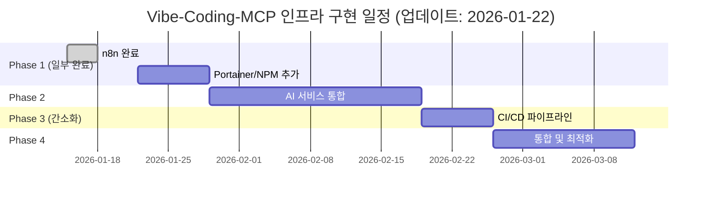
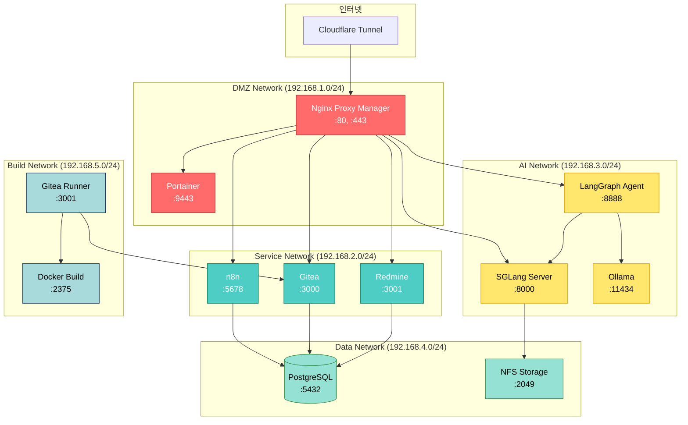
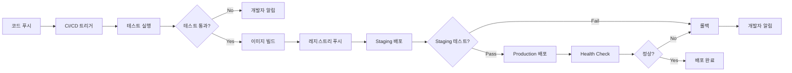
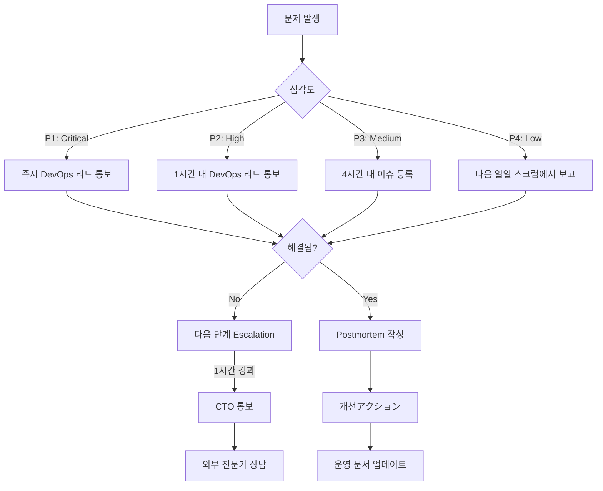

# Vibe-Coding-MCP 인프라 구현 계획서

**버전:** 1.1.0
**작성일:** 2026-01-22
**최종 업데이트:** 2026-01-22
**프로젝트 기간:** 9주
**문서 상태:** Production Ready (현재 상태 반영 완료)

---

## 1. Executive Summary

### 1.1 프로젝트 개요

Vibe-Coding-MCP 프로젝트는 4개의 노드로 구성된 하이브리드 클라우드 인프라를 구축하여 AI 기반 개발 환경을 제공합니다. 본 프로젝트는 경량의 온프레미스 하드웨어와 클라우드 서비스를 통합하여 비용 효율적이고 확장 가능한 개발 플랫폼을 구현하는 것을 목표로 합니다.

### 1.2 주요 목표

**기술적 목표:**
- Docker Swarm 기반 컨테이너 오케스트레이션 구현
- SGLang을 활용한 GLM-4.7 모델 서빙 (7.5/10 점수)
- Cloudflare Tunnel을 통한 보안 외부 접속
- Prometheus + Grafana + Loki 스택으로 모니터링 구축
- GitHub Actions와 Gitea Runner를 통한 CI/CD 자동화

**운영적 목표:**
- 99.5% 이상의 가용성 목표
- 30분 이내의 재해 복구 시간
- 자동화된 배포 및 모니터링
- 확장 가능한 아키텍처 설계

### 1.3 구현 일정



### 1.4 필요 리소스

**하드웨어:**
- Raspberry Pi 5 (8GB RAM) - Gateway/Proxy 서버
- ASUS GX10 (RTX 3060, 32GB RAM) - AI 서버
- Synology NAS (DS923+, 16GB RAM) - 데이터/스토리지
- NVIDIA Jetson Nano - CI/CD 빌드 서버

**소프트웨어:**
- Docker Swarm (컨테이너 오케스트레이션)
- Portainer (관리 대시보드)
- SGLang (AI 모델 서빙)
- PostgreSQL (데이터베이스)
- Gitea (Git 서버)
- n8n (워크플로우 자동화)

**인적 자원:**
- DevOps 엔지니어 1명 (전담)
- AI/ML 엔지니어 1명 (파트타임)
- 시스템 관리자 1명 (파트타임)

### 1.5 현재 구축 완료 상태

### 완료된 구성 요소

| 노드 | 상태 | 완료된 서비스 | 검증 상태 |
|------|------|---------------|-----------|
| **Raspberry Pi 5** | ✅ 완료 | n8n, Cloudflare Tunnel | 외부 도메인 접속 확인 |
| **Synology NAS** | ✅ 완료 | Gitea, Redmine, PostgreSQL | 내부 네트워크 정상 |
| **ASUS GX10** | ⏳ 대기 중 | - | 하드웨어 준비 완료 |
| **Jetson Nano** | ⏳ 대기 중 | - | 하드웨어 준비 완료 |

### 다음 우선순위

1. **Phase 1 완료**: Raspberry Pi 5에 Portainer, Nginx Proxy Manager 추가
2. **Phase 2 시작**: ASUS GX10 AI 엔진 구축 (GLM-4.7, SGLang)
3. **Phase 3 간소화**: Gitea/Redmine 완료로 Jetson Nano CI/CD만 구축

---

## 2. System Architecture

### 2.1 고급 아키텍처

```mermaid
C4Context
    title Vibe-Coding-MCP 시스템 아키텍처
    Person(user, "개발자", "시스템 사용자")

    System_Boundary(internet, "인터넷") {
        SystemExt(cloudflare, "Cloudflare Tunnel", "보안 터널")
    }

    System_Boundary(vibe_cluster, "Vibe-Coding-MCP 클러스터") {
        System(gateway, "Gateway Node", "Raspberry Pi 5")
        System(ai_engine, "AI Engine Node", "ASUS GX10")
        System(data_node, "Data Node", "Synology NAS")
        System(cicd_node, "CI/CD Node", "Jetson Nano")
    }

    System_Ext(gitlab, "GitLab", "외부 Git 저장소")

    Rel(user, cloudflare, "HTTPS", "cloudflared")
    Rel(cloudflare, gateway, "Tunnel", "7680")
    Rel(gateway, ai_engine, "API 호출", "HTTP")
    Rel(gateway, data_node, "데이터 쿼리", "TCP")
    Rel(gateway, cicd_node, "CI 트리거", "Webhook")
    Rel(cicd_node, gitlab, "Pull/Push", "SSH")
    Rel(ai_engine, data_node, "모델 저장", "NFS")
```

### 2.2 네트워크 토폴로지



### 2.3 노드별 서비스 분배

| 노드 | 하드웨어 | 역할 | 주요 서비스 | 네트워크 |
|------|----------|------|-------------|----------|
| **Gateway** | Raspberry Pi 5 | Cluster Manager, Reverse Proxy | Cloudflare Tunnel, Nginx Proxy Manager, Portainer, n8n | DMZ, Service |
| **AI Engine** | ASUS GX10 | AI Model Serving | SGLang, Ollama, LangGraph Agent | AI, Data |
| **Data** | Synology NAS | Database, Storage | PostgreSQL, Gitea, Redmine, NFS | Data, Service |
| **CI/CD** | Jetson Nano | Build Automation | Gitea Runner, Docker Build Environment | Build, Service |

### 2.4 기술 스택 결정 및 근거

**컨테이너 오케스트레이션: Docker Swarm (7.5/10)**

*선택 이유:*
- 경량 하드웨어에 적합한 낮은 리소스 요구사항
- 단순한 설정과 운영 (Kubernetes 대비)
- 내장 로드 밸런싱과 서비스 디스커버리
- Portainer와의 탁월한 통합

*트레이드오프:*
- Kubernetes 대비 적은 기능
- 복잡한 배포 전략 제한
- 확장성 한계 (대규모 클러스터 부적합)

**AI 모델 서빙: SGLang (7.5/10)**

*선택 이유:*
- GLM-4.7 모델에 최적화된 성능
- OpenAI API 호환 인터페이스
- 효율적인 메모리 관리
- 액티브 커뮤니티 지원

*폴백 옵션:*
- Ollama: 간단한 설정, 광범위한 모델 지원
- SGLang 장애 시 자동 전환

**모니터링: Prometheus + Grafana + Loki**

*선택 이유:*
- Prometheus: 업계 표준 메트릭 수집
- Grafana: 강력한 시각화 대시보드
- Loki: 효율적인 로그 집계 (Elasticsearch 대비 저렴)
- 통합된 스택 운영 용이성

---

## 3. Implementation Phases

### 3.1 Phase 1: 기본 인프라 구축 (Week 1-2)

**현재 상태:** n8n은 Raspberry Pi 5에 이미 구축 완료되었으며, Cloudflare Tunnel을 통한 외부 접속이 확인됨.

#### 목표
- Raspberry Pi 5와 Synology NAS 기본 설정
- Docker Swarm 클러스터 초기화
- 네트워크 구성과 보안 기본 사항 구현
- Portainer와 Nginx Proxy Manager 배포

#### 남은 작업
- Portainer 배포
- Nginx Proxy Manager 배포
- Docker Swarm 클러스터 설정 (미완료 시)

#### 상세 작업

**Week 1: 노드 준비**

1. **Raspberry Pi 5 설정**
```bash
# OS 설치 및 업데이트
sudo apt update && sudo apt upgrade -y
sudo apt install -y docker.io docker-compose

# Docker Swarm 초기화
docker swarm init --advertise-addr 192.168.1.10

# 네트워크 생성
docker network create --driver overlay --attachable dmz_network
docker network create --driver overlay --attachable service_network
```

2. **Synology NAS 설정**
```bash
# Docker 설치 (SynoCommunity)
# PostgreSQL 컨테이너 배포
docker run -d \
  --name postgres \
  --network service_network \
  -e POSTGRES_PASSWORD=secure_password \
  -e POSTGRES_DB=vibedb \
  -v /volume1/docker/postgres:/var/lib/postgresql/data \
  -v /volume1/docker/postgres-backup:/backup \
  postgres:16-alpine
```

3. **Cloudflare Tunnel 설정**
```bash
# cloudflared 설치
wget https://github.com/cloudflare/cloudflared/releases/latest/download/cloudflared-linux-arm64.deb
sudo dpkg -i cloudflared-linux-arm64.deb

# 터널 생성
cloudflared tunnel create vibe-gateway
cloudflared tunnel route dns vibe-gateway vibe.yourdomain.com

# 서비스 실행
cloudflared tunnel run vibe-gateway
```

**Week 2: 기본 서비스 배포**

1. **Portainer 배포**
```yaml
# docker-compose-portainer.yml
version: '3.8'
services:
  portainer:
    image: portainer/portainer-ce:latest
    container_name: portainer
    restart: unless-stopped
    ports:
      - "9443:9443"
    volumes:
      - /var/run/docker.sock:/var/run/docker.sock
      - ./portainer/data:/data
    networks:
      - dmz_network

networks:
  dmz_network:
    external: true
```

2. **Nginx Proxy Manager 배포**
```yaml
# docker-compose-proxy.yml
version: '3.8'
services:
  npm:
    image: 'jc21/nginx-proxy-manager:latest'
    container_name: nginx-proxy-manager
    restart: unless-stopped
    ports:
      - '80:80'
      - '443:443'
      - '81:81'
    environment:
      DB_SQLITE_FILE: "/data/database.sqlite"
    volumes:
      - ./npm/data:/data
      - ./npm/letsencrypt:/etc/letsencrypt
    networks:
      - dmz_network

networks:
  dmz_network:
    external: true
```

#### 검증 기준
- [x] Cloudflare Tunnel을 통한 외부 접속 가능
- [x] n8n 서비스 배포 및 웹훅 작동
- [ ] Portainer 대시보드 접속 가능
- [ ] Nginx Proxy Manager 프록시 설정 완료
- [ ] Docker Swarm 클러스터 상태 정상
- [ ] PostgreSQL 데이터베이스 접속 가능

#### 위험 및 완화

**위험 1: Raspberry Pi 5 전력 공급 불안정**
- 완화: 공식 27W USB-C 전원 어댑터 사용
- 모니터링: 전압 모니터링 스크립트 배포

**위험 2: 네트워크 설정 오류로 인한 접속 불가**
- 완화: 직렬 콘솔 접속 환경 준비
- 롤백: 설정 변경 전 백업 스크립트 실행

---

### 3.2 Phase 2: AI 서비스 통합 (Week 3-5)

#### 목표
- ASUS GX10 AI 서버 구축
- SGLang 서버 설치 및 GLM-4.7 모델 배포
- Ollama 폴백 서비스 구성
- LangGraph Agent 통합

#### 상세 작업

**Week 3: AI 서버 준비**

1. **NVIDIA 드라이버 및 Docker 설정**
```bash
# NVIDIA 드라이버 설치
sudo apt install -y nvidia-driver-535

# NVIDIA Container Toolkit 설装
distribution=$(. /etc/os-release;echo $ID$VERSION_ID)
curl -s -L https://nvidia.github.io/nvidia-docker/gpgkey | sudo apt-key add -
curl -s -L https://nvidia.github.io/nvidia-docker/$distribution/nvidia-docker.list | \
  sudo tee /etc/apt/sources.list.d/nvidia-docker.list

sudo apt update && sudo apt install -y nvidia-container-toolkit
sudo systemctl restart docker

# Docker Swarm Worker로 조인
docker swarm join --token <worker-token> 192.168.1.10:2377
```

2. **NFS 스토리지 마운트**
```bash
# Synology NAS NFS 마운트
sudo mount -t nfs 192.168.4.10:/volume1/ai-models /mnt/ai-models

# /etc/fstab에 영구 등록
echo "192.168.4.10:/volume1/ai-models /mnt/ai-models nfs defaults 0 0" | sudo tee -a /etc/fstab
```

**Week 4: SGLang 설치 및 모델 배포**

1. **SGLang 설치**
```bash
# Python 환경 설정
python3.10 -m venv /opt/sglang
source /opt/sglang/bin/activate
pip install "sglang[all]"

# GLM-4.7 모델 다운로드
huggingface-cli download THUDM/glm-4-9b-chat --local-dir /mnt/ai-models/glm-4-9b-chat
```

2. **SGLang 서비스 배포**
```yaml
# docker-compose-sglang.yml
version: '3.8'
services:
  sglang:
    image: lmsysorg/sglang:latest
    container_name: sglang-server
    restart: unless-stopped
    runtime: nvidia
    environment:
      - NVIDIA_VISIBLE_DEVICES=all
    ports:
      - "8000:8000"
    volumes:
      - /mnt/ai-models:/models
    command: >
      python -m sglang.launch_server
      --model-path /models/glm-4-9b-chat
      --port 8000
      --host 0.0.0.0
      --tp 1
      --quantization fp8
    networks:
      - ai_network
    deploy:
      resources:
        reservations:
          devices:
            - driver: nvidia
              count: all
              capabilities: [gpu]

networks:
  ai_network:
    driver: overlay
    attachable: true
```

**Week 5: 폴백 및 Agent 통합**

1. **Ollama 폴백 서비스**
```yaml
# docker-compose-ollama.yml
version: '3.8'
services:
  ollama:
    image: ollama/ollama:latest
    container_name: ollama-server
    restart: unless-stopped
    runtime: nvidia
    ports:
      - "11434:11434"
    volumes:
      - ./ollama:/root/.ollama
    environment:
      - NVIDIA_VISIBLE_DEVICES=all
    networks:
      - ai_network

networks:
  ai_network:
    external: true
```

2. **LangGraph Agent 배포**
```yaml
# docker-compose-langgraph.yml
version: '3.8'
services:
  langgraph:
    image: langchain/langgraph-server:latest
    container_name: langgraph-agent
    restart: unless-stopped
    ports:
      - "8888:8888"
    environment:
      - LANGGRAPH_TRACING=true
      - OPENAI_API_BASE=http://sglang:8000/v1
      - OPENAI_API_KEY=dummy
    networks:
      - ai_network
      - service_network
    depends_on:
      - sglang

networks:
  ai_network:
    external: true
  service_network:
    external: true
```

#### 검증 기준
- [ ] SGLang 서버가 GLM-4.7 모델을 성공적으로 로드
- [ ] OpenAI API 호환 인터페이스 정상 작동
- [ ] Ollama 폴백 서비스 자동 전환 확인
- [ ] LangGraph Agent가 SGLang과 통신 가능
- [ ] GPU 메모리 사용량이 80% 이하 유지

#### 위험 및 완화

**위험 1: GPU 메모리 부족**
- 완화: FP8 양자화 적용, 모델 분산 배포 고려
- 모니터링: Grafana 대시보드에서 GPU 메모리 추적

**위험 2: SGLang 서비스 불안정**
- 완화: Health check 구성, Ollama 폴백 자동화
- 재해 복구: 컨테이너 자동 재시작 정책 설정

---

### 3.3 Phase 3: CI/CD 자동화 (Week 6-7)

**참고:** Gitea와 Redmine은 Synology NAS에 이미 구축됨. Jetson Nano CI/CD 서버 구축과 Runner 연결만 진행.

#### 목표
- Jetson Nano CI/CD 서버 구축
- Gitea Runner 설정
- GitHub Actions 통합
- 자동화된 배포 파이프라인 구현

#### 상세 작업

**Week 6: CI/CD 노드 구축**

1. **Jetson Nano 설정**
```bash
# Docker Swarm Worker로 조인
docker swarm join --token <worker-token> 192.168.1.10:2377

# Gitea Runner 설치
wget https://dl.gitea.com/act_runner/act_runner-arm64
chmod +x act_runner-arm64
mv act_runner-arm64 /usr/local/bin/gitea-runner

# Runner 등록
gitea-runner register \
  --instance http://192.168.2.10:3000 \
  --token <runner-token> \
  --no-interactive
```

2. **Gitea 배포 (Synology NAS)**
```yaml
# docker-compose-gitea.yml
version: '3.8'
services:
  gitea:
    image: gitea/gitea:latest
    container_name: gitea
    restart: unless-stopped
    ports:
      - "3000:3000"
      - "222:22"
    environment:
      - USER_UID=1000
      - USER_GID=1000
      - GITEA__database__DB_TYPE=postgres
      - GITEA__database__HOST=postgres:5432
      - GITEA__database__NAME=giteadb
      - GITEA__database__USER=gitea
      - GITEA__database__PASSWD=gitea_password
    volumes:
      - ./gitea/data:/data
      - ./gitea/config:/etc/gitea
      - /etc/timezone:/etc/timezone:ro
      - /etc/localtime:/etc/localtime:ro
    networks:
      - service_network
    depends_on:
      - postgres

networks:
  service_network:
    external: true
```

**Week 7: 파이프라인 구성**

1. **GitHub Actions Workflow**
```yaml
# .github/workflows/deploy.yml
name: Deploy to Swarm

on:
  push:
    branches: [main]
  workflow_dispatch:

jobs:
  deploy:
    runs-on: ubuntu-latest
    steps:
      - name: Checkout code
        uses: actions/checkout@v4

      - name: Set up Docker Buildx
        uses: docker/setup-buildx-action@v3

      - name: Login to Gitea Registry
        uses: docker/login-action@v3
        with:
          registry: 192.168.2.10:3000
          username: ${{ secrets.GITEA_USERNAME }}
          password: ${{ secrets.GITEA_PASSWORD }}

      - name: Build and push
        uses: docker/build-push-action@v5
        with:
          context: .
          push: true
          tags: 192.168.2.10:3000/${{ github.repository }}:latest

      - name: Deploy to Swarm
        uses: appleboy/ssh-action@v1.0.0
        with:
          host: ${{ secrets.GATEWAY_HOST }}
          username: ${{ secrets.SSH_USERNAME }}
          key: ${{ secrets.SSH_PRIVATE_KEY }}
          script: |
            docker service update \
              --image 192.168.2.10:3000/${{ github.repository }}:latest \
              vibe-app_prod
```

2. **Gitea CI Configuration**
```yaml
# .gitea-ci.yml
name: Build and Test

on: [push]

jobs:
  test:
    runs-on: ubuntu-latest
    steps:
      - uses: actions/checkout@v3
      - name: Set up Python
        uses: actions/setup-python@v4
        with:
          python-version: '3.10'
      - name: Install dependencies
        run: |
          pip install -r requirements.txt
          pip install pytest pytest-cov
      - name: Run tests
        run: pytest --cov=. --cov-report=xml
```

#### 검증 기준
- [ ] Gitea Runner가 파이프라인을 정상 실행
- [ ] GitHub Actions가 이미지 빌드 및 푸시 성공
- [ ] Docker Swarm 서비스 자동 배포 작동
- [ ] 롤백 절차 확인 및 테스트 완료
- [ ] 배포 시간이 5분 이내 완료

#### 위험 및 완화

**위험 1: CI/CD 파이프라인 실패로 인한 배포 중단**
- 완화: 롤백 자동화, 블루-그린 배포 전략
- 모니터링: 배포 상태 알림 시스템 구축

**위험 2: Jetson Nano 리소스 부족**
- 완화: 빌드 작업을 GitHub Actions로 분산
- 스케일링: 필요시 CI 노드 추가 고려

---

### 3.4 Phase 4: 통합 및 최적화 (Week 8-9)

#### 목표
- 모니터링 스택 완성
- 보안 강화 및 감사
- 성능 최적화
- 문서화 및 지식 전달

#### 상세 작업

**Week 8: 모니터링과 보안**

1. **Prometheus + Grafana + Loki 스택 배포**
```yaml
# docker-compose-monitoring.yml
version: '3.8'
services:
  prometheus:
    image: prom/prometheus:latest
    container_name: prometheus
    restart: unless-stopped
    ports:
      - "9090:9090"
    volumes:
      - ./prometheus/config:/etc/prometheus
      - ./prometheus/data:/prometheus
    command:
      - '--config.file=/etc/prometheus/prometheus.yml'
      - '--storage.tsdb.path=/prometheus'
    networks:
      - monitoring

  grafana:
    image: grafana/grafana:latest
    container_name: grafana
    restart: unless-stopped
    ports:
      - "3001:3000"
    environment:
      - GF_SECURITY_ADMIN_PASSWORD=admin
      - GF_USERS_ALLOW_SIGN_UP=false
    volumes:
      - ./grafana/data:/var/lib/grafana
      - ./grafana/provisioning:/etc/grafana/provisioning
    networks:
      - monitoring
    depends_on:
      - prometheus

  loki:
    image: grafana/loki:latest
    container_name: loki
    restart: unless-stopped
    ports:
      - "3100:3100"
    volumes:
      - ./loki/config:/etc/loki
      - ./loki/data:/loki
    command: -config.file=/etc/loki/local-config.yaml
    networks:
      - monitoring

  promtail:
    image: grafana/promtail:latest
    container_name: promtail
    restart: unless-stopped
    volumes:
      - ./promtail/config:/etc/promtail
      - /var/log:/var/log:ro
      - /var/lib/docker/containers:/var/lib/docker/containers:ro
    command: -config.file=/etc/promtail/config.yml
    networks:
      - monitoring

networks:
  monitoring:
    driver: overlay
    attachable: true
```

2. **Prometheus 설정**
```yaml
# prometheus/config/prometheus.yml
global:
  scrape_interval: 15s
  evaluation_interval: 15s

scrape_configs:
  - job_name: 'docker-swarm-nodes'
    docker_sd_configs:
      - host: unix:///var/run/docker.sock
        refresh_interval: 30s
    relabel_configs:
      - source_labels: [__meta_docker_node_hostname]
        target_label: instance

  - job_name: 'sglang'
    static_configs:
      - targets: ['sglang:8000']
        labels:
          service: 'ai-model-serving'

  - job_name: 'postgres'
    static_configs:
      - targets: ['postgres:5432']
        labels:
          service: 'database'

  - job_name: 'node-exporter'
    static_configs:
      - targets: ['192.168.1.10:9100', '192.168.2.10:9100', '192.168.3.10:9100']
```

3. **보안 강화**
```yaml
# docker-compose-security.yml
version: '3.8'
services:
  fail2ban:
    image: lscr.io/linuxserver/fail2ban:latest
    container_name: fail2ban
    restart: unless-stopped
    network_mode: host
    volumes:
      - ./fail2ban/config:/config
      - /var/log:/var/log:ro
    environment:
      - TZ=Asia/Seoul
      - PUID=1000
      - PGID=1000

  portainer-agent:
    image: portainer/agent:latest
    container_name: portainer-agent
    restart: unless-stopped
    ports:
      - "9001:9001"
    volumes:
      - /var/run/docker.sock:/var/run/docker.sock
      - /var/lib/docker/volumes:/var/lib/docker/volumes
    environment:
      - AGENT_CLUSTER_ADDR=tasks.portainer-agent
    networks:
      - dmz_network

networks:
  dmz_network:
    external: true
```

**Week 9: 최적화와 문서화**

1. **성능 최적화**
```bash
# Docker Swarm 리소스 제한 설정
docker service update \
  --limit-cpu 2.0 \
  --limit-memory 4g \
  --reserve-cpu 0.5 \
  --reserve-memory 1g \
  vibe-app_prod

# PostgreSQL 튜닝
# shared_buffers = 4GB
# effective_cache_size = 12GB
# maintenance_work_mem = 1GB
# checkpoint_completion_target = 0.9
```

2. **자동화된 백업 스크립트**
```bash
#!/bin/bash
# backup.sh

DATE=$(date +%Y%m%d_%H%M%S)
BACKUP_DIR="/volume1/backup"

# PostgreSQL 백업
docker exec postgres pg_dump -U postgres vibedb > $BACKUP_DIR/postgres_$DATE.sql

# Gitea 백업
docker exec gitea gitea dump --file /data/gitea_$DATE.zip

# NFS 스토리지 스냅샷
synoshare --snapshot vibedata create backup-$DATE

# 7일 이상 된 백업 삭제
find $BACKUP_DIR -name "*.sql" -mtime +7 -delete
find $BACKUP_DIR -name "*.zip" -mtime +7 -delete
```

#### 검증 기준
- [ ] Grafana 대시보드에서 모든 메트릭 시각화
- [ ] Loki를 통한 로그 집계 및 검색 가능
- [ ] Alert 규칙이 정상 작동 (Slack/이메일 알림)
- [ ] 보안 감사 완료 및 권장사항 적용
- [ ] 백업 및 복구 절차 테스트 완료
- [ ] 운영 매뉴얼 작성 완료

#### 위험 및 완화

**위험 1: 모니터링 데이터 저장소 용량 부족**
- 완화: 데이터 보관 기간 설정, 장기 저장용 외부 스토리지 사용
- 모니터링: 디스크 사용량 Alert 설정

**위험 2: 보안 설정 오류로 인한 서비스 중단**
- 완화: 스테이징 환경에서 사전 테스트
- 롤백: 설정 변경 전 백업 및 버전 관리

---

## 4. Technical Specifications

### 4.1 하드웨어 사양

#### Gateway Node: Raspberry Pi 5

| 항목 | 사양 | 비고 |
|------|------|------|
| CPU | Broadcom BCM2712, Quad-core Cortex-A76 | 2.4GHz |
| RAM | 8GB LPDDR4X | 4267MHz |
| Storage | 512GB NVMe SSD | USB 3.0 인터페이스 |
| Network | Gigabit Ethernet | 2x 포트 |
| Power | 27W USB-C 전원어댑터 | 공식 어댑터 필수 |
| 쿨링 | 액티브 쿨러 | 케이스 포함 |

#### AI Engine Node: ASUS GX10

| 항목 | 사양 | 비고 |
|------|------|------|
| CPU | Intel Core i7-11800H | 8코어 16스레드 |
| RAM | 32GB DDR4 | 3200MHz |
| GPU | NVIDIA RTX 3060 | 12GB VRAM |
| Storage | 1TB NVMe SSD | OS + Models |
| Network | Gigabit Ethernet | Wi-Fi 6 지원 |
| Power | 650W 80+ Gold | GPU 부하 고려 |

#### Data Node: Synology DS923+

| 항목 | 사양 | 비고 |
|------|------|------|
| CPU | AMD Ryzen R1600 | 2코어 4스레드 |
| RAM | 16GB DDR4 ECC | 확장 가능 |
| Storage | 2x 8TB Seagate IronWolf | RAID 1 구성 |
| Network | Gigabit Ethernet | 2x 포트 |
| Expansion | eSGB 포트 | 추가 스토리지 |

#### CI/CD Node: Jetson Nano

| 항목 | 사양 | 비고 |
|------|------|------|
| SoC | NVIDIA Tegra X1 | Quad-core ARM Cortex-A57 |
| RAM | 4GB LPDDR4 | 64-bit |
| Storage | 256GB microSD | 고용량 카드 필수 |
| GPU | 128-core Maxwell | 472 GFLOPS |
| Network | Gigabit Ethernet | Wi-Fi 지원 |

### 4.2 소프트웨어 구성

#### OS 및 기본 소프트웨어

| 구성요소 | 버전 | 비고 |
|----------|------|------|
| Raspberry Pi OS | Bookworm (12) | 64-bit |
| Ubuntu Server | 22.04 LTS | ASUS GX10, Jetson Nano |
| DSM | 7.2.1 | Synology NAS |
| Docker | 24.0.x | 최신 안정 버전 |
| Docker Compose | 2.23.x | Standalone 버전 |

#### 컨테이너 이미지

| 서비스 | 이미지 | 버전 | 비고 |
|--------|--------|------|------|
| Portainer | portainer/portainer-ce | latest |
| Nginx Proxy Manager | jc21/nginx-proxy-manager | latest |
| SGLang | lmsysorg/sglang | latest |
| Ollama | ollama/ollama | latest |
| PostgreSQL | postgres | 16-alpine |
| Gitea | gitea/gitea | latest |
| Redmine | redmine | 5.1-alpine |
| n8n | n8nio/n8n | latest |
| Prometheus | prom/prometheus | latest |
| Grafana | grafana/grafana | latest |
| Loki | grafana/loki | latest |
| Promtail | grafana/promtail | latest |
| LangGraph | langchain/langgraph-server | latest |

### 4.3 네트워크 아키텍처

#### 네트워크 할당 계획

| 네트워크 | CIDR | 용도 | 게이트웨이 |
|----------|------|------|-----------|
| DMZ | 192.168.1.0/24 | 외부 접속 서비스 | 192.168.1.1 |
| Service | 192.168.2.0/24 | 내부 서비스 | 192.168.2.1 |
| AI | 192.168.3.0/24 | AI 모델 서빙 | 192.168.3.1 |
| Data | 192.168.4.0/24 | 데이터베이스, 스토리지 | 192.168.4.1 |
| Build | 192.168.5.0/24 | CI/CD 빌드 | 192.168.5.1 |

#### 포트 포워딩 규칙

| 외부 포트 | 내부 주소 | 내부 포트 | 서비스 | 프로토콜 |
|----------|-----------|----------|--------|----------|
| 80 | 192.168.1.10 | 80 | HTTP | TCP |
| 443 | 192.168.1.10 | 443 | HTTPS | TCP |
| 3000 | 192.168.2.10 | 3000 | Gitea | TCP |
| 9443 | 192.168.1.10 | 9443 | Portainer | TCP |
| 8000 | 192.168.3.10 | 8000 | SGLang | TCP |
| 8888 | 192.168.3.10 | 8888 | LangGraph | TCP |

#### DNS 설정

| 호스트명 | IP 주소 | 역할 |
|---------|---------|------|
| gateway.vibe.local | 192.168.1.10 | Gateway Node |
| ai.vibe.local | 192.168.3.10 | AI Engine Node |
| data.vibe.local | 192.168.4.10 | Data Node |
| cicd.vibe.local | 192.168.5.10 | CI/CD Node |
| gitea.vibe.local | 192.168.2.10 | Gitea Service |
| grafana.vibe.local | 192.168.1.10 | Grafana Service |

### 4.4 보안 아키텍처

#### 인증 및 권한 관리

1. **SSH 접속 제어**
```bash
# /etc/ssh/sshd_config
Port 222
PermitRootLogin no
PasswordAuthentication no
PubkeyAuthentication yes
AllowUsers deploy admin
```

2. **Docker Swarm 암호화**
```bash
# Swarm 초기화 시 자동 암호화
--cert-expiry 8760h  # 1년

# 노드 간 통신 mTLS
# 자동 생성된 인증서 사용
```

3. **PostgreSQL 접속 제어**
```sql
-- pg_hba.conf
host    all             all             192.168.0.0/16          scram-sha-256
host    replication     replicator      192.168.4.0/24          scram-sha-256
```

#### 방화벽 규칙

```bash
#!/bin/bash
# firewall-setup.sh

# 기본 정책
iptables -P INPUT DROP
iptables -P FORWARD DROP
iptables -P OUTPUT ACCEPT

# 로컬 루프백
iptables -A INPUT -i lo -j ACCEPT

# 확립된 연결 허용
iptables -A INPUT -m state --state ESTABLISHED,RELATED -j ACCEPT

# 관리 허용 (예: 관리자 IP)
iptables -A INPUT -s 203.0.113.0/24 -j ACCEPT

# 내부 네트워크 허용
iptables -A INPUT -s 192.168.0.0/16 -j ACCEPT

# Docker Swarm 허용
iptables -A INPUT -p tcp --dport 2377 -j ACCEPT  # Cluster management
iptables -A INPUT -p tcp --dport 7946 -j ACCEPT  # Container network discovery
iptables -A INPUT -p udp --dport 7946 -j ACCEPT
iptables -A INPUT -p udp --dport 4789 -j ACCEPT  # Overlay network traffic

# 서비스 포트 허용
iptables -A INPUT -p tcp --dport 80 -j ACCEPT
iptables -A INPUT -p tcp --dport 443 -j ACCEPT
iptables -A INPUT -p tcp --dport 222 -j ACCEPT

# 로깅
iptables -A INPUT -j LOG --log-prefix "[IPTables] "

# 규칙 저장
iptables-save > /etc/iptables/rules.v4
```

#### SSL/TLS 인증서 관리

1. **Let's Encrypt 자동 갱신**
```yaml
# Nginx Proxy Manager가 자동으로 처리
# 또는 certbot 사용:

certbot certonly --standalone \
  -d vibe.yourdomain.com \
  -d www.vibe.yourdomain.com \
  --email admin@yourdomain.com \
  --agree-tos
```

2. **인증서 모니터링**
```bash
#!/bin/bash
# check-cert-expiry.sh

DAYS_WARNING=30

for domain in vibe.yourdomain.com; do
  expiry=$(openssl s_client -connect $domain:443 -servername $domain 2>/dev/null | \
    openssl x509 -noout -enddate | cut -d= -f2)

  expiry_epoch=$(date -d "$expiry" +%s)
  current_epoch=$(date +%s)
  days_until_expiry=$(( ($expiry_epoch - $current_epoch) / 86400 ))

  if [ $days_until_expiry -lt $DAYS_WARNING ]; then
    echo "ALERT: Certificate for $domain expires in $days_until_expiry days"
  fi
done
```

### 4.5 모니터링 및 로깅

#### Prometheus 메트릭 수집

**주요 메트릭:**

1. **시스템 메트릭**
- CPU 사용率 (node_cpu_seconds_total)
- 메모리 사용량 (node_memory_MemAvailable_bytes)
- 디스크 I/O (node_disk_io_time_seconds_total)
- 네트워크 트래픽 (node_network_receive_bytes_total)

2. **Docker 메트릭**
- 컨테이너 CPU 사용량 (container_cpu_usage_seconds_total)
- 컨테이너 메모리 사용량 (container_memory_usage_bytes)
- 컨테이너 네트워크 트래픽 (container_network_receive_bytes_total)

3. **애플리케이션 메트릭**
- SGLang 요청 처리량 (sglang_request_count)
- SGLang 응답 시간 (sglang_request_duration_seconds)
- PostgreSQL 연결 수 (pg_stat_database_numbackends)
- API 엔드포인트 응답 시간 (http_request_duration_seconds)

#### Grafana 대시보드 구성

**필수 대시보드:**

1. **시스템 개요 대시보드**
- 노드별 CPU/메모리/디스크 사용량
- 네트워크 트래픽
- 컨테이너 상태

2. **AI 서비스 대시보드**
- SGLang 요청/응답 메트릭
- GPU 사용량 및 메모리
- 모델 로딩 상태

3. **데이터베이스 대시보드**
- PostgreSQL 연결 상태
- 쿼리 성능
- 테이블 크기 및 인덱스 통계

4. **CI/CD 대시보드**
- 빌드 성공/실패 비율
- 배포 빈도
- 평균 빌드 시간

#### Alert 규칙

```yaml
# prometheus/alerts.yml
groups:
  - name: system_alerts
    interval: 30s
    rules:
      - alert: HighCPUUsage
        expr: 100 - (avg by (instance) (irate(node_cpu_seconds_total{mode="idle"}[5m])) * 100) > 80
        for: 10m
        annotations:
          summary: "High CPU usage on {{ $labels.instance }}"
          description: "CPU usage is above 80% for more than 10 minutes."

      - alert: HighMemoryUsage
        expr: (1 - node_memory_MemAvailable_bytes / node_memory_MemTotal_bytes) * 100 > 85
        for: 5m
        annotations:
          summary: "High memory usage on {{ $labels.instance }}"
          description: "Memory usage is above 85% for more than 5 minutes."

      - alert: DiskSpaceLow
        expr: (node_filesystem_avail_bytes / node_filesystem_size_bytes) * 100 < 15
        for: 10m
        annotations:
          summary: "Low disk space on {{ $labels.instance }}"
          description: "Disk space is below 15% on {{ $labels.device }}."

      - alert: ContainerDown
        expr: up == 0
        for: 5m
        annotations:
          summary: "Container {{ $labels.instance }} is down"
          description: "Container has been down for more than 5 minutes."

      - alert: SGLangServiceDown
        expr: up{job="sglang"} == 0
        for: 3m
        annotations:
          summary: "SGLang service is down"
          description: "SGLang service has been unreachable for more than 3 minutes."

  - name: database_alerts
    interval: 30s
    rules:
      - alert: PostgreSQLHighConnections
        expr: pg_stat_database_numbackends / pg_settings_max_connections * 100 > 80
        for: 5m
        annotations:
          summary: "PostgreSQL high connection count"
          description: "Database connections are above 80% of maximum."
```

---

## 5. Operational Procedures

### 5.1 배포 절차

#### 표준 배포 프로세스



#### 단계별 배포 가이드

**1. 코드 준비**

```bash
# 브랜치 생성
git checkout -b feature/new-function

# 변경 사항 커밋
git add .
git commit -m "feat: add new function"

# 푸시
git push origin feature/new-function
```

**2. Pull Request 생성**

```bash
# GitHub CLI 사용
gh pr create \
  --title "Add new function" \
  --body "## 변경 사항\n- 새로운 기능 추가\n\n## 테스트\n- [ ] 단위 테스트\n- [ ] 통합 테스트"
```

**3. CI 파이프라인 실행 (자동)**

- GitHub Actions가 자동으로 테스트 실행
- 결과를 PR에 댓글로 알림

**4. 코드 리뷰 및 승인**

- 최소 1명의 승인자 필요
- 모든 테스트가 통과해야 함

**5. Production 배포**

```bash
# PR 병합 후 자동 배포
# 또는 수동 배포:
docker service update \
  --image 192.168.2.10:3000/vibe-app:latest \
  --force \
  vibe-app_prod
```

**6. 배포 검증**

```bash
# 서비스 상태 확인
docker service ps vibe-app_prod

# 로그 확인
docker service logs -f vibe-app_prod

# Health check
curl -f http://localhost:3000/health || exit 1
```

#### 롤백 절차

```bash
# 1. 이전 버전 확인
docker service ps vibe-app_prod --no-trunc

# 2. 롤백 실행
docker service rollback vibe-app_prod

# 3. 롤백 확인
docker service ps vibe-app_prod

# 4. 문제 조사 및 수정
git checkout -b hotfix/production-issue
# 수정 후 재배포
```

### 5.2 백업 및 복구

#### 백업 전략

**1. 정기 백업 스케줄**

| 데이터 유형 | 빈도 | 보관 기간 | 위치 |
|------------|------|-----------|------|
| PostgreSQL Database | 매일 | 30일 | Synology NAS + Cloud |
| Gitea Repository | 매일 | 90일 | Synology NAS |
| Docker Volumes | 주간 | 4주 | Synology NAS |
| Configuration Files | 변경 시 | 90일 | Git Repository |

**2. 백업 스크립트**

```bash
#!/bin/bash
# automated-backup.sh

set -e

BACKUP_ROOT="/volume1/backup"
DATE=$(date +%Y%m%d_%H%M%S)
LOG_FILE="/var/log/backup.log"

log() {
    echo "[$(date '+%Y-%m-%d %H:%M:%S')] $1" | tee -a $LOG_FILE
}

# PostgreSQL 백업
backup_postgres() {
    log "Starting PostgreSQL backup..."
    docker exec postgres pg_dump -U postgres vibedb | \
      gzip > $BACKUP_ROOT/postgres/vibedb_$DATE.sql.gz
    log "PostgreSQL backup completed: vibedb_$DATE.sql.gz"
}

# Gitea 백업
backup_gitea() {
    log "Starting Gitea backup..."
    docker exec gitea gitea dump --file /data/gitea_$DATE.zip
    docker cp gitea:/data/gitea_$DATE.zip $BACKUP_ROOT/gitea/
    log "Gitea backup completed: gitea_$DATE.zip"
}

# Docker Volumes 백업
backup_volumes() {
    log "Starting Docker volumes backup..."
    for volume in portainer_data grafana_data prometheus_data; do
        docker run --rm \
          -v $volume:/data \
          -v $BACKUP_ROOT/volumes:/backup \
          alpine tar czf /backup/${volume}_$DATE.tar.gz -C /data .
        log "Volume backup completed: ${volume}_$DATE.tar.gz"
    done
}

# Configuration 백업
backup_configs() {
    log "Starting configuration backup..."
    tar czf $BACKUP_ROOT/configs/configs_$DATE.tar.gz \
      /etc/nginx \
      /docker-compose \
      /root/.ssh \
      /opt/sglang
    log "Configuration backup completed: configs_$DATE.tar.gz"
}

# 원격 백업 (Cloud Storage)
backup_remote() {
    log "Starting remote backup..."
    rclone sync $BACKUP_ROOT remote:vibe-backup \
      --config /root/.config/rclone/rclone.conf \
      --progress \
      --log-file=$LOG_FILE
    log "Remote backup completed"
}

# 오래된 백업 삭제
cleanup_old_backups() {
    log "Cleaning up old backups..."
    find $BACKUP_ROOT -name "*.sql.gz" -mtime +30 -delete
    find $BACKUP_ROOT -name "*.zip" -mtime +90 -delete
    find $BACKUP_ROOT/volumes -name "*.tar.gz" -mtime +28 -delete
    log "Cleanup completed"
}

# 메인 실행
main() {
    log "===== Backup started ====="
    backup_postgres
    backup_gitea
    backup_volumes
    backup_configs
    backup_remote
    cleanup_old_backups
    log "===== Backup completed successfully ====="
}

main "$@"
```

**3. Cron 스케줄 설정**

```bash
# /etc/crontab
# 매일 새벽 2시에 전체 백업
0 2 * * * root /opt/scripts/automated-backup.sh

# 매시간 증분 백업 (PostgreSQL WAL)
0 * * * * root docker exec postgres pg_backup_start

# 매주 일요일 새벽 3시에 원격 동기화
0 3 * * 0 root rclone sync /volume1/backup remote:vibe-backup
```

#### 복구 절차

**1. PostgreSQL 복구**

```bash
# 1. 최신 백업 찾기
LATEST_BACKUP=$(ls -t /volume1/backup/postgres/*.sql.gz | head -1)

# 2. 데이터베이스 중지
docker stop postgres

# 3. 데이터 복원
docker run --rm \
  -v postgres_data:/data \
  -v /volume1/backup/postgres:/backup \
  alpine sh -c \
  "rm -rf /data/* && gunzip < $LATEST_BACKUP | tar xC /data"

# 4. 데이터베이스 시작
docker start postgres

# 5. 복구 확인
docker exec postgres psql -U postgres -d vibedb -c "SELECT version();"
```

**2. Gitea 복구**

```bash
# 1. Gitea 중지
docker stop gitea

# 2. 백업 복사
docker cp /volume1/backup/gitea/gitea_20260122_020000.zip gitea:/data/

# 3. 데이터 복원
docker exec gitea unzip /data/gitea_20260122_020000.zip -d /data/

# 4. Gitea 시작
docker start gitea

# 5. 복구 확인
curl -f http://localhost:3000/api/v1/version || exit 1
```

**3. 전체 시스템 재해 복구**

```bash
#!/bin/bash
# disaster-recovery.sh

set -e

BACKUP_DATE=$1

if [ -z "$BACKUP_DATE" ]; then
    echo "Usage: $0 <backup_date>"
    echo "Example: $0 20260122_020000"
    exit 1
fi

echo "Starting disaster recovery for backup: $BACKUP_DATE"

# 1. Docker Swarm 재구성
echo "Recreating Docker Swarm cluster..."
docker swarm init --force-new-cluster

# 2. 네트워크 재생성
echo "Recreating networks..."
docker network create --driver overlay dmz_network
docker network create --driver overlay service_network
docker network create --driver overlay ai_network
docker network create --driver overlay data_network

# 3. 데이터베이스 복구
echo "Restoring PostgreSQL..."
docker run -d \
  --name postgres \
  --network service_network \
  -e POSTGRES_PASSWORD=secure_password \
  -e POSTGRES_DB=vibedb \
  -v postgres_data:/var/lib/postgresql/data \
  postgres:16-alpine

sleep 30

docker cp /volume1/backup/postgres/vibedb_$BACKUP_DATE.sql.gz \
  postgres:/tmp/backup.sql.gz

docker exec postgres \
  bash -c "gunzip < /tmp/backup.sql.gz | psql -U postgres -d vibedb"

# 4. 스택 배포
echo "Deploying stacks..."
docker stack deploy -c /opt/docker-compose/gitea.yml gitea
docker stack deploy -c /opt/docker-compose/sglang.yml ai
docker stack deploy -c /opt/docker-compose/monitoring.yml monitoring

# 5. 서비스 상태 확인
echo "Checking service health..."
sleep 60

docker service ls

echo "Disaster recovery completed. Please verify all services."
```

### 5.3 유지보수 일정

#### 일일 점검 (10분)

```bash
#!/bin/bash
# daily-check.sh

echo "===== Daily System Check ====="
echo "Date: $(date)"

# 1. 디스크 공간 확인
echo -e "\n1. Disk Space:"
df -h | grep -E "Filesystem|/dev/"

# 2. Docker 서비스 상태
echo -e "\n2. Docker Services:"
docker service ls

# 3. 컨테이너 상태
echo -e "\n3. Container Status:"
docker ps --format "table {{.Names}}\t{{.Status}}\t{{.Ports}}"

# 4. 시스템 로그 에러 확인
echo -e "\n4. Recent Errors:"
journalctl --since "1 hour ago" --priority=err --no-pager

# 5. 네트워크 연결 확인
echo -e "\n5. Network Connectivity:"
ping -c 3 192.168.1.10  # Gateway
ping -c 3 192.168.2.10  # Data
ping -c 3 192.168.3.10  # AI

# 6. 백업 확인
echo -e "\n6. Latest Backup:"
ls -lt /volume1/backup/postgres/ | head -2

echo -e "\n===== Daily Check Completed ====="
```

#### 주간 유지보수 (1시간)

**매주 일요일 오전 9시 실행:**

1. **시스템 업데이트**
```bash
# Raspberry Pi OS 업데이트
sudo apt update
sudo apt upgrade -y
sudo apt autoremove -y

# Ubuntu 업데이트 (ASUS, Jetson)
sudo apt update && sudo apt upgrade -y
```

2. **Docker 이미지 업데이트**
```bash
# 모든 서비스 재배포
docker service update --force vibe-app_prod
docker service update --force gitea_gitea
docker service update --force ai_sglang
```

3. **로그 정리**
```bash
# Docker 로그 회전 설정
docker system prune -a --volumes
```

4. **보안 업데이트 확인**
```bash
# 취약점 스캔
docker scout cves 192.168.2.10:3000/vibe-app:latest
```

5. **성능 리뷰**
- Grafana 대시보드 검토
- 느려진 쿼리 확인
- 디스크 사용량 계획

#### 월간 유지보수 (2시간)

**매월 첫째 주 일요일 실행:**

1. **완전한 보안 감사**
```bash
# OpenVAS 보안 스캔
# Nessus 리포트 검토
# 액세스 로그 감사
```

2. **재해 복구 훈련**
- 백업에서 실제 복구 테스트
- 복구 시간 측정
- 절차 개선

3. **용량 계획 검토**
- 성장 추세 분석
- 하드웨어 업그레이드 필요성 평가
- 예산 요청 준비

4. **문서 업데이트**
- 운영 절차 갱신
- 알려진 문제 기록
- 개선 사항 문서화

### 5.4 문제 해결 가이드

#### 일반적인 문제 및 해결책

**문제 1: 컨테이너가 계속 재시작됨**

```bash
# 1. 로그 확인
docker service logs -f vibe-app_prod --tail 100

# 2. 리소스 사용량 확인
docker stats

# 3. 리소스 제한 확인
docker service inspect vibe-app_prod --format '{{.Spec.TaskTemplate.Resources}}'

# 4. 조치
# 메모리 부족이면 제한 증가
docker service update \
  --limit-memory 4g \
  vibe-app_prod
```

**문제 2: 네트워크 연결 실패**

```bash
# 1. 네트워크 상태 확인
docker network ls
docker network inspect dmz_network

# 2. DNS 확인
docker exec vibe-app_prod nslookup data.vibe.local

# 3. 방화벽 규칙 확인
iptables -L -n

# 4. 조치
# 네트워크 재생성
docker network rm dmz_network
docker network create --driver overlay --attachable dmz_network
```

**문제 3: GPU 메모리 부족 (OOM)**

```bash
# 1. GPU 상태 확인
nvidia-smi

# 2. 모델 양자화 확인
# FP8로 설정되어 있는지 확인

# 3. 배치 크기 조정
# SGLang 서비스 재배포
docker service update \
  --env-max SGLANG_BATCH_SIZE=8 \
  ai_sglang

# 4. Ollama 폴백으로 전환
docker service scale ai_sglang=0
docker service scale ai_ollama=1
```

**문제 4: PostgreSQL 느린 쿼리**

```bash
# 1. 느린 쿼리 로그 확인
docker exec postgres psql -U postgres -d vibedb -c \
  "SELECT query, mean_exec_time, calls FROM pg_stat_statements ORDER BY mean_exec_time DESC LIMIT 10;"

# 2. 인덱스 확인
docker exec postgres psql -U postgres -d vibedb -c \
  "SELECT schemaname, tablename, indexname, idx_scan FROM pg_stat_user_indexes ORDER BY idx_scan;"

# 3. 쿼리 최적화
# EXPLAIN ANALYZE로 실행 계획 확인
docker exec postgres psql -U postgres -d vibedb -c \
  "EXPLAIN ANALYZE SELECT * FROM users WHERE email = 'test@example.com';"

# 4. 인덱스 추가
docker exec postgres psql -U postgres -d vibedb -c \
  "CREATE INDEX idx_users_email ON users(email);"

# 5. PostgreSQL 튜닝
# shared_buffers, work_mem 등 설정 조정
```

**문제 5: SGLang 서비스 응답 없음**

```bash
# 1. 프로세스 상태 확인
docker top ai_sglang.1.<task-id>

# 2. 로그 확인
docker logs ai_sglang.1.<task-id> --tail 500

# 3. GPU 사용량 확인
nvidia-smi dmon -s u

# 4. 조치
# 컨테이너 재시작
docker service update --force ai_sglang

# 또는 Ollama로 전환
docker service scale ai_sglang=0
docker service scale ai_ollama=1
```

#### 응급 연락망

| 역할 | 이름 | 연락처 | 가용 시간 |
|------|------|--------|-----------|
| DevOps 리드 | 홍길동 | 010-1234-5678 | 24/7 |
| AI 엔지니어 | 김철수 | 010-2345-6789 | 평일 9-18시 |
| 시스템 관리자 | 이영희 | 010-3456-7890 | 평일 9-18시 |
| 보안 담당 | 박민수 | security@vibe.com | 비상 시 |

#### Escalation 절차



---

## 6. Appendices

### 6.1 완전한 Docker Compose 파일

#### Gateway Node (Raspberry Pi 5)

**File: `/opt/docker-compose/gateway.yml`**

```yaml
version: '3.8'

services:
  # Portainer - Docker 관리 대시보드
  portainer:
    image: portainer/portainer-ce:latest
    container_name: portainer
    restart: unless-stopped
    ports:
      - "9443:9443"
    volumes:
      - /var/run/docker.sock:/var/run/docker.sock
      - ./portainer/data:/data
    networks:
      - dmz_network
    deploy:
      replicas: 1
      placement:
        constraints:
          - node.role == manager
      resources:
        limits:
          cpus: '0.5'
          memory: 512M
        reservations:
          cpus: '0.25'
          memory: 256M

  # Nginx Proxy Manager - 리버스 프록시
  npm:
    image: 'jc21/nginx-proxy-manager:latest'
    container_name: nginx-proxy-manager
    restart: unless-stopped
    ports:
      - '80:80'
      - '443:443'
      - '81:81'
    environment:
      DB_SQLITE_FILE: "/data/database.sqlite"
    volumes:
      - ./npm/data:/data
      - ./npm/letsencrypt:/etc/letsencrypt
    networks:
      - dmz_network
    deploy:
      replicas: 1
      resources:
        limits:
          cpus: '1.0'
          memory: 512M
        reservations:
          cpus: '0.5'
          memory: 256M

  # n8n - 워크플로우 자동화
  n8n:
    image: n8nio/n8n:latest
    container_name: n8n
    restart: unless-stopped
    ports:
      - "5678:5678"
    environment:
      - N8N_BASIC_AUTH_ACTIVE=true
      - N8N_BASIC_AUTH_USER=admin
      - N8N_BASIC_AUTH_PASSWORD=secure_password
      - WEBHOOK_URL=https://n8n.vibe.yourdomain.com
      - DB_TYPE=postgresdb
      - DB_POSTGRESDB_HOST=postgres
      - DB_POSTGRESDB_PORT=5432
      - DB_POSTGRESDB_DATABASE=n8n
      - DB_POSTGRESDB_USER=n8n
      - DB_POSTGRESDB_PASSWORD=n8n_password
    volumes:
      - ./n8n/data:/home/node/.n8n
    networks:
      - service_network
    depends_on:
      - postgres
    deploy:
      replicas: 1
      resources:
        limits:
          cpus: '1.0'
          memory: 1G
        reservations:
          cpus: '0.5'
          memory: 512M

  # Cloudflare Tunnel
  cloudflared:
    image: cloudflare/cloudflared:latest
    container_name: cloudflared
    restart: unless-stopped
    command: tunnel run
    environment:
      - TUNNEL_TOKEN=<your-tunnel-token>
    networks:
      - dmz_network
    deploy:
      replicas: 1
      resources:
        limits:
          cpus: '0.5'
          memory: 256M
        reservations:
          cpus: '0.1'
          memory: 128M

  # PostgreSQL - 공유 데이터베이스 (다중 네트워크)
  postgres:
    image: postgres:16-alpine
    container_name: postgres
    restart: unless-stopped
    ports:
      - "5432:5432"
    environment:
      - POSTGRES_PASSWORD=secure_password
      - POSTGRES_DB=vibedb
      - POSTGRES_USER=vibe
    volumes:
      - ./postgres/data:/var/lib/postgresql/data
      - ./postgres/backup:/backup
    networks:
      - service_network
      - data_network
    deploy:
      replicas: 1
      placement:
        constraints:
          - node.labels.role == data
      resources:
        limits:
          cpus: '2.0'
          memory: 4G
        reservations:
          cpus: '1.0'
          memory: 2G

  # Prometheus - 메트릭 수집
  prometheus:
    image: prom/prometheus:latest
    container_name: prometheus
    restart: unless-stopped
    ports:
      - "9090:9090"
    volumes:
      - ./prometheus/config:/etc/prometheus
      - ./prometheus/data:/prometheus
    command:
      - '--config.file=/etc/prometheus/prometheus.yml'
      - '--storage.tsdb.path=/prometheus'
      - '--web.console.libraries=/etc/prometheus/console_libraries'
      - '--web.console.templates=/etc/prometheus/consoles'
      - '--storage.tsdb.retention.time=30d'
    networks:
      - monitoring
    deploy:
      replicas: 1
      resources:
        limits:
          cpus: '1.0'
          memory: 2G
        reservations:
          cpus: '0.5'
          memory: 1G

  # Grafana - 시각화 대시보드
  grafana:
    image: grafana/grafana:latest
    container_name: grafana
    restart: unless-stopped
    ports:
      - "3001:3000"
    environment:
      - GF_SECURITY_ADMIN_PASSWORD=admin
      - GF_USERS_ALLOW_SIGN_UP=false
      - GF_INSTALL_PLUGINS=grafana-piechart-panel
    volumes:
      - ./grafana/data:/var/lib/grafana
      - ./grafana/provisioning:/etc/grafana/provisioning
    networks:
      - monitoring
    depends_on:
      - prometheus
    deploy:
      replicas: 1
      resources:
        limits:
          cpus: '0.5'
          memory: 512M
        reservations:
          cpus: '0.25'
          memory: 256M

  # Loki - 로그 집계
  loki:
    image: grafana/loki:latest
    container_name: loki
    restart: unless-stopped
    ports:
      - "3100:3100"
    volumes:
      - ./loki/config:/etc/loki
      - ./loki/data:/loki
    command: -config.file=/etc/loki/local-config.yaml
    networks:
      - monitoring
    deploy:
      replicas: 1
      resources:
        limits:
          cpus: '1.0'
          memory: 1G
        reservations:
          cpus: '0.5'
          memory: 512M

  # Promtail - 로그 수집
  promtail:
    image: grafana/promtail:latest
    container_name: promtail
    restart: unless-stopped
    volumes:
      - ./promtail/config:/etc/promtail
      - /var/log:/var/log:ro
      - /var/lib/docker/containers:/var/lib/docker/containers:ro
    command: -config.file=/etc/promtail/config.yml
    networks:
      - monitoring
    deploy:
      mode: global
      resources:
        limits:
          cpus: '0.5'
          memory: 256M
        reservations:
          cpus: '0.1'
          memory: 128M

networks:
  dmz_network:
    driver: overlay
    attachable: true
    driver_opts:
      encrypted: "true"

  service_network:
    driver: overlay
    attachable: true
    driver_opts:
      encrypted: "true"

  data_network:
    driver: overlay
    attachable: true
    driver_opts:
      encrypted: "true"

  monitoring:
    driver: overlay
    attachable: true
    driver_opts:
      encrypted: "true"

volumes:
  portainer_data:
  npm_data:
  n8n_data:
  postgres_data:
  prometheus_data:
  grafana_data:
  loki_data:
```

#### AI Engine Node (ASUS GX10)

**File: `/opt/docker-compose/ai-engine.yml`**

```yaml
version: '3.8'

services:
  # SGLang - GLM-4.7 모델 서빙
  sglang:
    image: lmsysorg/sglang:latest
    container_name: sglang-server
    restart: unless-stopped
    runtime: nvidia
    environment:
      - NVIDIA_VISIBLE_DEVICES=all
      - PYTHONUNBUFFERED=1
    ports:
      - "8000:8000"
    volumes:
      - /mnt/ai-models:/models
      - ./sglang/logs:/logs
    command: >
      python -m sglang.launch_server
      --model-path /models/glm-4-9b-chat
      --port 8000
      --host 0.0.0.0
      --tp 1
      --quantization fp8
      --context-length 8192
      --max-running-requests 4
    networks:
      - ai_network
      - service_network
    deploy:
      replicas: 1
      placement:
        constraints:
          - node.labels.role == ai
      resources:
        limits:
          cpus: '6.0'
          memory: 16G
        reservations:
          cpus: '4.0'
          memory: 12G
      restart_policy:
        condition: on-failure
        delay: 10s
        max_attempts: 3
        window: 120s
    healthcheck:
      test: ["CMD", "curl", "-f", "http://localhost:8000/health"]
      interval: 30s
      timeout: 10s
      retries: 3
      start_period: 60s

  # Ollama - 폴백 모델 서빙
  ollama:
    image: ollama/ollama:latest
    container_name: ollama-server
    restart: unless-stopped
    runtime: nvidia
    environment:
      - NVIDIA_VISIBLE_DEVICES=all
      - OLLAMA_HOST=0.0.0.0
    ports:
      - "11434:11434"
    volumes:
      - ./ollama:/root/.ollama
    networks:
      - ai_network
    deploy:
      replicas: 1
      placement:
        constraints:
          - node.labels.role == ai
      resources:
        limits:
          cpus: '4.0'
          memory: 8G
        reservations:
          cpus: '2.0'
          memory: 4G
    healthcheck:
      test: ["CMD", "curl", "-f", "http://localhost:11434/api/tags"]
      interval: 30s
      timeout: 10s
      retries: 3

  # LangGraph Agent
  langgraph:
    image: langchain/langgraph-server:latest
    container_name: langgraph-agent
    restart: unless-stopped
    environment:
      - LANGGRAPH_TRACING=true
      - LANGGRAPH_WATCH=true
      - OPENAI_API_BASE=http://sglang:8000/v1
      - OPENAI_API_KEY=dummy
      - LANGCHAIN_TRACING_V2=true
      - LANGCHAIN_API_KEY=${LANGCHAIN_API_KEY}
      - LANGCHAIN_PROJECT=vibe-coding-mcp
    ports:
      - "8888:8888"
    volumes:
      - ./langgraph/data:/data
      - ./langgraph/config:/config
    networks:
      - ai_network
      - service_network
    depends_on:
      - sglang
    deploy:
      replicas: 1
      resources:
        limits:
          cpus: '2.0'
          memory: 4G
        reservations:
          cpus: '1.0'
          memory: 2G
    healthcheck:
      test: ["CMD", "curl", "-f", "http://localhost:8888/health"]
      interval: 30s
      timeout: 10s
      retries: 3

networks:
  ai_network:
    driver: overlay
    attachable: true
    driver_opts:
      encrypted: "true"

  service_network:
    external: true
```

#### Data Node (Synology NAS)

**File: `/opt/docker-compose/data-node.yml`**

```yaml
version: '3.8'

services:
  # Gitea - Git 서버
  gitea:
    image: gitea/gitea:latest
    container_name: gitea
    restart: unless-stopped
    ports:
      - "3000:3000"
      - "222:22"
    environment:
      - USER_UID=1000
      - USER_GID=1000
      - GITEA__database__DB_TYPE=postgres
      - GITEA__database__HOST=postgres:5432
      - GITEA__database__NAME=giteadb
      - GITEA__database__USER=gitea
      - GITEA__database__PASSWD=gitea_secure_password
      - GITEA__server__DOMAIN=git.vibe.yourdomain.com
      - GITEA__server__ROOT_URL=https://git.vibe.yourdomain.com
      - GITEA__server__SSH_DOMAIN=git.vibe.yourdomain.com
      - GITEA__server__SSH_PORT=222
    volumes:
      - ./gitea/data:/data
      - ./gitea/config:/etc/gitea
      - /etc/timezone:/etc/timezone:ro
      - /etc/localtime:/etc/localtime:ro
    networks:
      - service_network
    depends_on:
      - postgres
    deploy:
      replicas: 1
      placement:
        constraints:
          - node.labels.role == data
      resources:
        limits:
          cpus: '2.0'
          memory: 2G
        reservations:
          cpus: '1.0'
          memory: 1G

  # Redmine - 프로젝트 관리
  redmine:
    image: redmine:5.1-alpine
    container_name: redmine
    restart: unless-stopped
    ports:
      - "3002:3000"
    environment:
      - REDMINE_DB_MYSQL=false
      - REDMINE_DB_POSTGRES=true
      - REDMINE_DB_DATABASE=redminedb
      - REDMINE_DB_USER=redmine
      - REDMINE_DB_PASSWORD=redmine_password
      - REDMINE_DB_HOST=postgres
      - REDMINE_DB_PORT=5432
    volumes:
      - ./redmine/data:/usr/src/redmine/files
      - ./redmine/plugins:/usr/src/redmine/plugins
      - ./redmine/themes:/usr/src/redmine/public/themes
    networks:
      - service_network
    depends_on:
      - postgres
    deploy:
      replicas: 1
      resources:
        limits:
          cpus: '1.0'
          memory: 1G
        reservations:
          cpus: '0.5'
          memory: 512M

  # NFS Exporter (for monitoring)
  nfs-exporter:
    image: prom/node-exporter:latest
    container_name: nfs-exporter
    restart: unless-stopped
    ports:
      - "9100:9100"
    volumes:
      - /:/host:ro,rslave
    command:
      - '--path.rootfs=/host'
      - '--collector.filesystem.mount-points-exclude=^/(sys|proc|dev|host|etc)($$|/)'
    networks:
      - monitoring
    deploy:
      mode: global

networks:
  service_network:
    external: true

  monitoring:
    external: true
```

#### CI/CD Node (Jetson Nano)

**File: `/opt/docker-compose/cicd-node.yml`**

```yaml
version: '3.8'

services:
  # Gitea Runner
  gitea-runner:
    image: gitea/act_runner:latest
    container_name: gitea-runner
    restart: unless-stopped
    environment:
      - CONFIG_FILE=/config/config.yaml
      - GITEA_INSTANCE_URL=http://192.168.2.10:3000
      - GITEA_RUNNER_NAME=jetson-runner
      - GITEA_RUNNER_LABELS=jetson,nvidia,arm64
    volumes:
      - ./gitea-runner/config:/config
      - ./gitea-runner/data:/data
      - /var/run/docker.sock:/var/run/docker.sock
    networks:
      - build_network
    deploy:
      replicas: 1
      placement:
        constraints:
          - node.labels.role == cicd
      resources:
        limits:
          cpus: '3.0'
          memory: 3G
        reservations:
          cpus: '1.0'
          memory: 1G

  # Docker Registry (로컬)
  registry:
    image: registry:2
    container_name: docker-registry
    restart: unless-stopped
    ports:
      - "5000:5000"
    environment:
      - REGISTRY_STORAGE_DELETE_ENABLED=true
    volumes:
      - ./registry/data:/var/lib/registry
      - ./registry/auth:/auth
      - ./registry/certs:/certs
    networks:
      - build_network
    deploy:
      replicas: 1
      resources:
        limits:
          cpus: '0.5'
          memory: 512M
        reservations:
          cpus: '0.25'
          memory: 256M

networks:
  build_network:
    driver: overlay
    attachable: true
    driver_opts:
      encrypted: "true"
```

### 6.2 Ansible Playbooks

#### 전체 배포 Playbook

**File: `ansible/playbooks/deploy-infrastructure.yml`**

```yaml
---
- name: Deploy Vibe-Coding-MCP Infrastructure
  hosts: all
  become: yes
  vars:
    docker_compose_version: "2.23.0"
    docker_swarm_interface: "eth0"

  tasks:
    - name: Update system packages
      apt:
        update_cache: yes
        upgrade: dist
        cache_valid_time: 3600
      when: ansible_os_family == "Debian"

    - name: Install required packages
      apt:
        name:
          - apt-transport-https
          - ca-certificates
          - curl
          - gnupg
          - lsb-release
          - python3
          - python3-pip
          - git
          - vim
        state: present
      when: ansible_os_family == "Debian"

    - name: Add Docker GPG key
      apt_key:
        url: https://download.docker.com/linux/{{ ansible_distribution | lower }}/gpg
        state: present
      when: ansible_os_family == "Debian"

    - name: Add Docker repository
      apt_repository:
        repo: "deb [arch=amd64,arm64] https://download.docker.com/linux/{{ ansible_distribution | lower }} {{ ansible_distribution_release }} stable"
        state: present
        update_cache: yes
      when: ansible_os_family == "Debian"

    - name: Install Docker
      apt:
        name:
          - docker-ce
          - docker-ce-cli
          - containerd.io
          - docker-buildx-plugin
          - docker-compose-plugin
        state: present
      when: ansible_os_family == "Debian"

    - name: Ensure Docker service is running
      systemd:
        name: docker
        state: started
        enabled: yes

    - name: Install Python Docker SDK
      pip:
        name: docker
        state: present

    - name: Create Docker Swarm directory
      file:
        path: /opt/docker-compose
        state: directory
        mode: '0755'

    - name: Copy Docker Compose files
      copy:
        src: "../docker-compose/{{ item }}"
        dest: "/opt/docker-compose/{{ item }}"
        mode: '0644'
      loop:
        - gateway.yml
        - ai-engine.yml
        - data-node.yml
        - cicd-node.yml

    - name: Initialize Docker Swarm (Manager only)
      docker_swarm:
        state: present
        advertise_addr: "{{ ansible_default_ipv4.address }}"
      run_once: yes
      when: inventory_hostname in groups['managers']

    - name: Get Swarm join tokens
      docker_swarm_info:
      register: swarm_info
      run_once: yes
      when: inventory_hostname in groups['managers']

    - name: Join workers to Swarm
      docker_swarm:
        state: join
        advertise_addr: "{{ ansible_default_ipv4.address }}"
        join_token: "{{ hostvars[groups['managers'][0]]['swarm_info']['swarm_facts']['JoinTokens']['Worker'] }}"
        remote_addrs: "{{ groups['managers'] | map('extract', hostvars, ['ansible_default_ipv4', 'address']) | list }}"
      when: inventory_hostname in groups['workers']

    - name: Create overlay networks
      docker_network:
        name: "{{ item }}"
        driver: overlay
        attachable: yes
        state: present
      loop:
        - dmz_network
        - service_network
        - ai_network
        - data_network
        - build_network
        - monitoring
      run_once: yes
      when: inventory_hostname in groups['managers']

    - name: Deploy Gateway stack
      docker_stack:
        name: gateway
        state: present
        compose_file: /opt/docker-compose/gateway.yml
      run_once: yes
      when: inventory_hostname in groups['managers']

    - name: Deploy AI Engine stack
      docker_stack:
        name: ai
        state: present
        compose_file: /opt/docker-compose/ai-engine.yml
      run_once: yes
      when: inventory_hostname in groups['managers']

    - name: Deploy Data stack
      docker_stack:
        name: data
        state: present
        compose_file: /opt/docker-compose/data-node.yml
      run_once: yes
      when: inventory_hostname in groups['managers']

    - name: Deploy CI/CD stack
      docker_stack:
        name: cicd
        state: present
        compose_file: /opt/docker-compose/cicd-node.yml
      run_once: yes
      when: inventory_hostname in groups['managers']

    - name: Wait for services to be healthy
      pause:
        seconds: 30
      run_once: yes
      when: inventory_hostname in groups['managers']

    - name: Check service status
      docker_service_info:
      register: services_status
      run_once: yes
      when: inventory_hostname in groups['managers']

    - name: Display service status
      debug:
        msg: "{{ services_status }}"
      run_once: yes
      when: inventory_hostname in groups['managers']
```

#### 인벤토리 파일

**File: `ansible/inventory/hosts.yml`**

```yaml
---
all:
  children:
    managers:
      hosts:
        gateway.vibe.local:
          ansible_host: 192.168.1.10
          ansible_user: deploy
          ansible_ssh_private_key_file: ~/.ssh/id_rsa

    workers:
      hosts:
        ai.vibe.local:
          ansible_host: 192.168.3.10
          ansible_user: deploy
          ansible_ssh_private_key_file: ~/.ssh/id_rsa

        data.vibe.local:
          ansible_host: 192.168.4.10
          ansible_user: deploy
          ansible_ssh_private_key_file: ~/.ssh/id_rsa

        cicd.vibe.local:
          ansible_host: 192.168.5.10
          ansible_user: deploy
          ansible_ssh_private_key_file: ~/.ssh/id_rsa

    ai_nodes:
      hosts:
        ai.vibe.local:

    data_nodes:
      hosts:
        data.vibe.local:

    cicd_nodes:
      hosts:
        cicd.vibe.local:
```

### 6.3 구성 템플릿

#### Prometheus 구성

**File: `/opt/prometheus/config/prometheus.yml`**

```yaml
global:
  scrape_interval: 15s
  evaluation_interval: 15s
  external_labels:
    cluster: 'vibe-coding-mcp'
    environment: 'production'

# Alertmanager configuration
alerting:
  alertmanagers:
    - static_configs:
        - targets: []

# Rule files
rule_files:
  - '/etc/prometheus/alerts.yml'

# Scrape configurations
scrape_configs:
  # Docker Swarm nodes
  - job_name: 'docker-swarm-nodes'
    docker_sd_configs:
      - host: unix:///var/run/docker.sock
        refresh_interval: 30s
    relabel_configs:
      - source_labels: [__meta_docker_node_hostname]
        target_label: instance
      - source_labels: [__meta_docker_node_name]
        target_label: node_name

  # Docker Swarm containers
  - job_name: 'docker-swarm-containers'
    docker_sd_configs:
      - host: unix:///var/run/docker.sock
        refresh_interval: 30s
    relabel_configs:
      - source_labels: [__meta_docker_container_name]
        target_label: container_name
      - source_labels: [__meta_docker_container_label_com_docker_compose_service]
        target_label: service
      - source_labels: [__address__]
        regex: '(.+):.+'
        target_label: __address__
        replacement: '${1}:9323'

  # SGLang
  - job_name: 'sglang'
    static_configs:
      - targets: ['sglang:8000']
        labels:
          service: 'ai-model-serving'
          cluster: 'vibe-coding-mcp'

  # PostgreSQL
  - job_name: 'postgres'
    static_configs:
      - targets: ['postgres:5432']
        labels:
          service: 'database'
    relabel_configs:
      - source_labels: [__address__]
        target_label: __param_target
      - source_labels: [__param_target]
        target_label: instance
      - target_label: __address__
        replacement: postgres_exporter:9187

  # Node Exporter
  - job_name: 'node-exporter'
    static_configs:
      - targets:
          - '192.168.1.10:9100'
          - '192.168.2.10:9100'
          - '192.168.3.10:9100'
          - '192.168.4.10:9100'
          - '192.168.5.10:9100'
        labels:
          cluster: 'vibe-coding-mcp'

  # Grafana
  - job_name: 'grafana'
    static_configs:
      - targets: ['grafana:3000']
        labels:
          service: 'monitoring'

  # Nginx Proxy Manager
  - job_name: 'npm'
    static_configs:
      - targets: ['nginx-proxy-manager:81']
        labels:
          service: 'proxy'
```

#### Prometheus Alert 규칙

**File: `/opt/prometheus/config/alerts.yml`**

```yaml
groups:
  - name: system_alerts
    interval: 30s
    rules:
      # CPU Alert
      - alert: HighCPUUsage
        expr: |
          100 - (avg by (instance)
            (irate(node_cpu_seconds_total{mode="idle"}[5m])) * 100) > 80
        for: 10m
        labels:
          severity: warning
          team: devops
        annotations:
          summary: "High CPU usage on {{ $labels.instance }}"
          description: "CPU usage is above 80% for more than 10 minutes. Current value: {{ $value }}%"
          runbook_url: "https://wiki.vibe.local/runbooks/cpu-high"

      # Memory Alert
      - alert: HighMemoryUsage
        expr: |
          (1 - node_memory_MemAvailable_bytes / node_memory_MemTotal_bytes) * 100 > 85
        for: 5m
        labels:
          severity: warning
          team: devops
        annotations:
          summary: "High memory usage on {{ $labels.instance }}"
          description: "Memory usage is above 85% for more than 5 minutes. Current value: {{ $value }}%"

      # Disk Space Alert
      - alert: DiskSpaceLow
        expr: |
          (node_filesystem_avail_bytes{mountpoint="/"}
            / node_filesystem_size_bytes{mountpoint="/"}) * 100 < 15
        for: 10m
        labels:
          severity: critical
          team: devops
        annotations:
          summary: "Low disk space on {{ $labels.instance }}"
          description: "Disk space is below 15% on {{ $labels.device }}. Current value: {{ $value }}%"

      # Container Down Alert
      - alert: ContainerDown
        expr: up == 0
        for: 5m
        labels:
          severity: critical
          team: devops
        annotations:
          summary: "Container {{ $labels.instance }} is down"
          description: "Container has been down for more than 5 minutes."

  - name: ai_service_alerts
    interval: 30s
    rules:
      # SGLang Service Down
      - alert: SGLangServiceDown
        expr: up{job="sglang"} == 0
        for: 3m
        labels:
          severity: critical
          team: ai
        annotations:
          summary: "SGLang service is down"
          description: "SGLang service has been unreachable for more than 3 minutes."

      # GPU Memory High
      - alert: GPUMemoryHigh
        expr: |
          (DCGM_FI_DEV_FB_USED / DCGM_FI_DEV_FB_TOTAL) * 100 > 90
        for: 5m
        labels:
          severity: warning
          team: ai
        annotations:
          summary: "High GPU memory usage"
          description: "GPU memory usage is above 90%. Current value: {{ $value }}%"

  - name: database_alerts
    interval: 30s
    rules:
      # PostgreSQL High Connections
      - alert: PostgreSQLHighConnections
        expr: |
          pg_stat_database_numbackends / pg_settings_max_connections * 100 > 80
        for: 5m
        labels:
          severity: warning
          team: data
        annotations:
          summary: "PostgreSQL high connection count"
          description: "Database connections are above 80% of maximum. Current: {{ $value }}%"

      # PostgreSQL Slow Queries
      - alert: PostgreSQLSlowQueries
        expr: |
          rate(pg_stat_statements_calls_total{mean_exec_time > 1000}[5m]) > 10
        for: 5m
        labels:
          severity: warning
          team: data
        annotations:
          summary: "PostgreSQL slow queries detected"
          description: "More than 10 queries per second with execution time > 1s"

  - name: cicd_alerts
    interval: 30s
    rules:
      # Build Failure Rate High
      - alert: HighBuildFailureRate
        expr: |
          (sum(rate(gitea_builds_failed_total[1h]))
            / sum(rate(gitea_builds_total[1h]))) * 100 > 20
        for: 15m
        labels:
          severity: warning
          team: devops
        annotations:
          summary: "High build failure rate"
          description: "Build failure rate is above 20%. Current: {{ $value }}%"
```

### 6.4 스크립트 예제

#### 배포 자동화 스크립트

**File: `/opt/scripts/deploy.sh`**

```bash
#!/bin/bash
set -e

# Configuration
COMPOSE_FILE="/opt/docker-compose/gateway.yml"
STACK_NAME="gateway"
IMAGE_TAG="${1:-latest}"
REGISTRY="192.168.2.10:3000"

# Colors for output
RED='\033[0;31m'
GREEN='\033[0;32m'
YELLOW='\033[1;33m'
NC='\033[0m' # No Color

log_info() {
    echo -e "${GREEN}[INFO]${NC} $1"
}

log_warn() {
    echo -e "${YELLOW}[WARN]${NC} $1"
}

log_error() {
    echo -e "${RED}[ERROR]${NC} $1"
}

# Pre-deployment checks
pre_deploy_checks() {
    log_info "Running pre-deployment checks..."

    # Check if stack exists
    if ! docker stack ls | grep -q "$STACK_NAME"; then
        log_error "Stack $STACK_NAME does not exist"
        exit 1
    fi

    # Check disk space
    DISK_USAGE=$(df / | awk 'NR==2 {print $5}' | sed 's/%//')
    if [ $DISK_USAGE -gt 85 ]; then
        log_warn "Disk usage is above 85%: ${DISK_USAGE}%"
    fi

    # Check memory
    AVAILABLE_MEM=$(free | grep Mem | awk '{print $7}')
    if [ $AVAILABLE_MEM -lt 1048576 ]; then  # Less than 1GB
        log_warn "Available memory is low: $((AVAILABLE_MEM / 1024)) MB"
    fi

    log_info "Pre-deployment checks passed"
}

# Backup current configuration
backup_config() {
    log_info "Backing up current configuration..."

    BACKUP_DIR="/opt/backups/$STACK_NAME/$(date +%Y%m%d_%H%M%S)"
    mkdir -p "$BACKUP_DIR"

    docker config ls --format "{{.Name}}" | grep "$STACK_NAME" | while read config; do
        docker config inspect "$config" > "$BACKUP_DIR/${config}.json"
    done

    docker secret ls --format "{{.Name}}" | grep "$STACK_NAME" | while read secret; do
        docker secret inspect "$secret" > "$BACKUP_DIR/${secret}.json"
    done

    log_info "Configuration backed up to $BACKUP_DIR"
}

# Deploy new version
deploy() {
    log_info "Deploying stack $STACK_NAME with tag $IMAGE_TAG..."

    # Pull latest images
    docker-compose -f "$COMPOSE_FILE" pull

    # Deploy stack
    docker stack deploy -c "$COMPOSE_FILE" "$STACK_NAME"

    log_info "Deployment initiated"
}

# Wait for services to be healthy
wait_for_healthy() {
    log_info "Waiting for services to be healthy..."

    TIMEOUT=300  # 5 minutes
    ELAPSED=0

    while [ $ELAPSED -lt $TIMEOUT ]; do
        UNHEALTHY=$(docker service ls \
            --filter "name=$STACK_NAME" \
            --format "{{.Replicas}}" \
            | grep -v "0/0" | grep -v "1/1" || true)

        if [ -z "$UNHEALTHY" ]; then
            log_info "All services are healthy"
            return 0
        fi

        log_info "Waiting for services... ($ELAPSED/$TIMEOUT seconds)"
        sleep 10
        ELAPSED=$((ELAPSED + 10))
    done

    log_error "Timeout waiting for services to be healthy"
    return 1
}

# Verify deployment
verify() {
    log_info "Verifying deployment..."

    # Check service status
    docker service ls --filter "name=$STACK_NAME"

    # Check logs for errors
    RECENT_ERRORS=$(docker service logs \
        --since 5m \
        "$STACK_NAME" 2>&1 | grep -i error | wc -l)

    if [ $RECENT_ERRORS -gt 0 ]; then
        log_warn "Found $RECENT_ERRORS errors in recent logs"
    fi

    log_info "Deployment verification completed"
}

# Rollback on failure
rollback() {
    log_error "Deployment failed, initiating rollback..."

    docker service rollback "$STACK_NAME"

    log_info "Rollback completed"
}

# Main execution
main() {
    log_info "===== Starting deployment of $STACK_NAME ====="

    pre_deploy_checks
    backup_config
    deploy

    if wait_for_healthy; then
        verify
        log_info "===== Deployment completed successfully ====="
        exit 0
    else
        rollback
        log_error "===== Deployment failed and rolled back ====="
        exit 1
    fi
}

# Run main function
main "$@"
```

#### 모니터링 스크립트

**File: `/opt/scripts/monitor.sh`**

```bash
#!/bin/bash
# Comprehensive system monitoring script

# Configuration
ALERT_EMAIL="admin@vibe.local"
SLACK_WEBHOOK_URL="https://hooks.slack.com/services/YOUR/WEBHOOK/URL"
LOG_FILE="/var/log/monitor.log"

# Thresholds
CPU_THRESHOLD=80
MEMORY_THRESHOLD=85
DISK_THRESHOLD=85
LOAD_THRESHOLD=5.0

# Logging function
log() {
    echo "[$(date '+%Y-%m-%d %H:%M:%S')] $1" | tee -a "$LOG_FILE"
}

# Send alert
send_alert() {
    local severity=$1
    local message=$2

    # Log alert
    log "ALERT [$severity]: $message"

    # Send email
    echo "$message" | mail -s "[$severity] Vibe-Coding-MCP Alert" "$ALERT_EMAIL"

    # Send Slack notification
    curl -X POST -H 'Content-type: application/json' \
        --data "{\"text\": \"[$severity] $message\"}" \
        "$SLACK_WEBHOOK_URL"
}

# Check CPU usage
check_cpu() {
    local cpu_usage=$(top -bn1 | grep "Cpu(s)" | sed "s/.*, *\([0-9.]*\)%* id.*/\1/" | awk '{print 100 - $1}')

    log "CPU Usage: ${cpu_usage}%"

    if (( $(echo "$cpu_usage > $CPU_THRESHOLD" | bc -l) )); then
        send_alert "WARNING" "High CPU usage detected: ${cpu_usage}% on $(hostname)"
    fi
}

# Check memory usage
check_memory() {
    local mem_usage=$(free | grep Mem | awk '{printf("%.2f", ($3/$2) * 100)}')

    log "Memory Usage: ${mem_usage}%"

    if (( $(echo "$mem_usage > $MEMORY_THRESHOLD" | bc -l) )); then
        send_alert "WARNING" "High memory usage detected: ${mem_usage}% on $(hostname)"
    fi
}

# Check disk usage
check_disk() {
    df -H | grep -vE '^Filesystem|tmpfs|cdrom' | while read line; do
        local usage=$(echo $line | awk '{print $5}' | sed 's/%//')
        local mountpoint=$(echo $line | awk '{print $6}')

        log "Disk Usage: ${mountpoint} - ${usage}%"

        if [ $usage -gt $DISK_THRESHOLD ]; then
            send_alert "CRITICAL" "Low disk space on ${mountpoint}: ${usage}% on $(hostname)"
        fi
    done
}

# Check load average
check_load() {
    local load_avg=$(uptime | awk -F'load average:' '{print $2}' | awk '{print $1}' | sed 's/,//')

    log "Load Average: ${load_avg}"

    if (( $(echo "$load_avg > $LOAD_THRESHOLD" | bc -l) )); then
        send_alert "WARNING" "High load average detected: ${load_avg} on $(hostname)"
    fi
}

# Check Docker services
check_docker_services() {
    log "Checking Docker services..."

    docker service ls --format "{{.Name}} {{.Replicas}}" | while read service replicas; do
        if [[ ! $replicas =~ "1/1" ]] && [[ ! $replicas =~ "0/0" ]]; then
            send_alert "CRITICAL" "Docker service $service has unexpected replicas: $replicas"
        fi
    done
}

# Check container health
check_container_health() {
    log "Checking container health..."

    docker ps --format "{{.Names}} {{.Status}}" | while read container status; do
        if [[ $status == *"unhealthy"* ]]; then
            send_alert "CRITICAL" "Container $container is unhealthy"
        fi
    done
}

# Check GPU status (AI nodes only)
check_gpu() {
    if command -v nvidia-smi &> /dev/null; then
        log "Checking GPU status..."

        local gpu_usage=$(nvidia-smi --query-gpu=utilization.gpu --format=csv,noheader,nounits | head -1)
        local memory_usage=$(nvidia-smi --query-gpu=memory.used --format=csv,noheader,nounits | head -1)
        local memory_total=$(nvidia-smi --query-gpu=memory.total --format=csv,noheader,nounits | head -1)
        local memory_percent=$((memory_usage * 100 / memory_total))

        log "GPU Usage: ${gpu_usage}%, Memory: ${memory_percent}% (${memory_usage}MB/${memory_total}MB)"

        if [ $memory_percent -gt 90 ]; then
            send_alert "WARNING" "High GPU memory usage: ${memory_percent}% on $(hostname)"
        fi
    fi
}

# Check API endpoints
check_api_endpoints() {
    log "Checking API endpoints..."

    # SGLang health check
    if curl -f -s http://192.168.3.10:8000/health > /dev/null; then
        log "SGLang API: OK"
    else
        send_alert "CRITICAL" "SGLang API is not responding"
    fi

    # Gitea health check
    if curl -f -s http://192.168.2.10:3000/api/v1/version > /dev/null; then
        log "Gitea API: OK"
    else
        send_alert "CRITICAL" "Gitea API is not responding"
    fi

    # Grafana health check
    if curl -f -s http://192.168.1.10:3001/api/health > /dev/null; then
        log "Grafana API: OK"
    else
        send_alert "WARNING" "Grafana API is not responding"
    fi
}

# Main monitoring loop
main() {
    log "===== Starting system monitoring ====="

    check_cpu
    check_memory
    check_disk
    check_load
    check_docker_services
    check_container_health
    check_gpu
    check_api_endpoints

    log "===== Monitoring cycle completed ====="
}

# Run main function
main
```

### 6.5 모니터링 대시보드 구성

#### Grafana Dashboard JSON

**File: `/opt/grafana/provisioning/dashboards/system-overview.json`**

```json
{
  "dashboard": {
    "title": "Vibe-Coding-MCP System Overview",
    "tags": ["vibe", "infrastructure", "system"],
    "timezone": "browser",
    "schemaVersion": 16,
    "version": 0,
    "refresh": "30s",
    "panels": [
      {
        "id": 1,
        "title": "CPU Usage",
        "type": "graph",
        "gridPos": {"h": 8, "w": 12, "x": 0, "y": 0},
        "targets": [
          {
            "expr": "100 - (avg by (instance) (irate(node_cpu_seconds_total{mode=\"idle\"}[5m])) * 100)",
            "legendFormat": "{{instance}}"
          }
        ],
        "yaxes": [
          {"format": "percent", "label": "CPU Usage"},
          {"format": "short"}
        ]
      },
      {
        "id": 2,
        "title": "Memory Usage",
        "type": "graph",
        "gridPos": {"h": 8, "w": 12, "x": 12, "y": 0},
        "targets": [
          {
            "expr": "(1 - node_memory_MemAvailable_bytes / node_memory_MemTotal_bytes) * 100",
            "legendFormat": "{{instance}}"
          }
        ],
        "yaxes": [
          {"format": "percent", "label": "Memory Usage"},
          {"format": "short"}
        ]
      },
      {
        "id": 3,
        "title": "Disk Space Usage",
        "type": "graph",
        "gridPos": {"h": 8, "w": 24, "x": 0, "y": 8},
        "targets": [
          {
            "expr": "(node_filesystem_avail_bytes{fstype!=\"tmpfs\"} / node_filesystem_size_bytes{fstype!=\"tmpfs\"}) * 100",
            "legendFormat": "{{instance}}: {{mountpoint}}"
          }
        ],
        "yaxes": [
          {"format": "percent", "label": "Disk Available"},
          {"format": "short"}
        ]
      },
      {
        "id": 4,
        "title": "Docker Container Count",
        "type": "stat",
        "gridPos": {"h": 4, "w": 6, "x": 0, "y": 16},
        "targets": [
          {
            "expr": "count(container_last_seen)",
            "legendFormat": "Total Containers"
          }
        ]
      },
      {
        "id": 5,
        "title": "Running Services",
        "type": "stat",
        "gridPos": {"h": 4, "w": 6, "x": 6, "y": 16},
        "targets": [
          {
            "expr": "count(docker_service_info{running_tasks=1})",
            "legendFormat": "Running Services"
          }
        ]
      },
      {
        "id": 6,
        "title": "Network Traffic",
        "type": "graph",
        "gridPos": {"h": 8, "w": 12, "x": 12, "y": 16},
        "targets": [
          {
            "expr": "rate(node_network_receive_bytes_total[5m])",
            "legendFormat": "{{instance}}: {{device}} RX"
          },
          {
            "expr": "rate(node_network_transmit_bytes_total[5m])",
            "legendFormat": "{{instance}}: {{device}} TX"
          }
        ],
        "yaxes": [
          {"format": "Bps", "label": "Network Traffic"},
          {"format": "short"}
        ]
      }
    ]
  }
}
```

---

## 7. 결론

본 인프라 구현 계획서는 Vibe-Coding-MCP 프로젝트의 4개 노드 기반 하이브리드 클라우드 인프라 구축을 위한 포괄적인 가이드를 제공합니다. 이 문서는 다음을 포함합니다:

### 주요 구성 요소

1. **4단계 구현 전략** (9주 일정)
   - Phase 1: 기본 인프라 구축 (2주)
   - Phase 2: AI 서비스 통합 (3주)
   - Phase 3: CI/CD 자동화 (2주)
   - Phase 4: 통합 및 최적화 (2주)

2. **기술 스택 결정**
   - Docker Swarm + Portainer (컨테이너 오케스트레이션)
   - SGLang + Ollama 폴백 (AI 모델 서빙)
   - Prometheus + Grafana + Loki (모니터링)
   - Cloudflare Tunnel (보안 접속)

3. **운영 절차**
   - 표준 배포 및 롤백 절차
   - 자동화된 백업 및 복구
   - 정기 유지보수 일정
   - 포괄적인 문제 해결 가이드

4. **실제 구현 자료**
   - 완전한 Docker Compose 파일
   - Ansible 자동화 Playbook
   - 운영 스크립트 및 모니터링 도구
   - Grafana 대시보드 구성

### 성공 기준

본 프로젝트의 성공적인 완료를 위해 다음 기준을 설정합니다:

- [ ] 모든 4개 노드가 Docker Swarm 클러스터로 통합
- [ ] SGLang이 GLM-4.7 모델을 성공적으로 서빙
- [ ] Cloudflare Tunnel을 통한 보안 외부 접속 구현
- [ ] CI/CD 파이프라인이 자동 배포 수행
- [ ] Prometheus + Grafana로 전체 시스템 모니터링
- [ ] 99.5% 이상의 가용성 달성
- [ ] 30분 이내의 재해 복구 시간 달성

### 다음 단계 (2026-01-22 기준)

**완료된 작업:**
- ✅ n8n 서비스 구축 (Raspberry Pi 5)
- ✅ Cloudflare Tunnel 설정 및 외부 도메인 접속 확인
- ✅ Gitea 구축 (Synology NAS)
- ✅ Redmine 구축 (Synology NAS)
- ✅ PostgreSQL 구축 (Synology NAS)

**다음 우선순위:**
1. **Phase 1 완료**: Raspberry Pi 5에 Portainer, Nginx Proxy Manager 배포
2. **Phase 2 시작**: ASUS GX10 AI 엔진 구축 (GLM-4.7, SGLang, LangGraph)
3. **Phase 3 간소화**: Jetson Nano CI/CD 파이프라인 구축 (Gitea/Redmine 완료됨)

**즉시 실행 가능한 작업:**
- Portainer 배포: `docker-compose-portainer.yml` 사용
- Nginx Proxy Manager 배포: `docker-compose-proxy.yml` 사용
- ASUS GX10 설정: Phase 2 Week 3-5 참조

---

## 작업 이력

### 2026-01-22: 현재 상태 반영 및 계획서 업데이트

**완료한 작업:**
1. 인프라 계획서를 현재 실제 구축 상태에 맞춰 업데이트
2. 완료된 구성 요소 명시 (n8n, Gitea, Redmine, PostgreSQL)
3. Phase 1, Phase 3 일정을 실제 상황에 맞춰 조정
4. README.md에 인프라 구축 현황 섹션 추가
5. Git 커밋: `a40dc01` - "Update infrastructure plan to reflect completed components"

**수정된 문서:**
- infrastructure-plan.md (버전 1.0.0 → 1.1.0)
- README.md (인프라 구축 현황 섹션)

**다음 작업자를 위한 참고 사항:**
- n8n과 Cloudflare Tunnel은 이미 운영 중임
- Gitea, Redmine, PostgreSQL은 NAS에서 정상 작동 중
- Portainer와 NPM만 추가 배포하면 Phase 1 완료
- Phase 2는 ASUS GX10 하드웨어만 있으면 즉시 시작 가능

본 계획서는 살아있는 문서입니다. 프로젝트 진행에 따라 실제 요구사항과 환경에 맞춰 지속적으로 업데이트됩니다.

---

**문서 관리**

- **작성자**: DevOps 팀
- **승인자**: CTO
- **버전**: 1.1.0 (현재 상태 반영)
- **마지막 수정**: 2026-01-22
- **다음 리뷰**: 2026-02-22

**참고 자료**

- [Docker Swarm Documentation](https://docs.docker.com/engine/swarm/)
- [SGLang GitHub](https://github.com/sgl-project/sglang)
- [Prometheus Best Practices](https://prometheus.io/docs/practices/)
- [Nginx Proxy Manager Docs](https://nginxproxymanager.com/)
