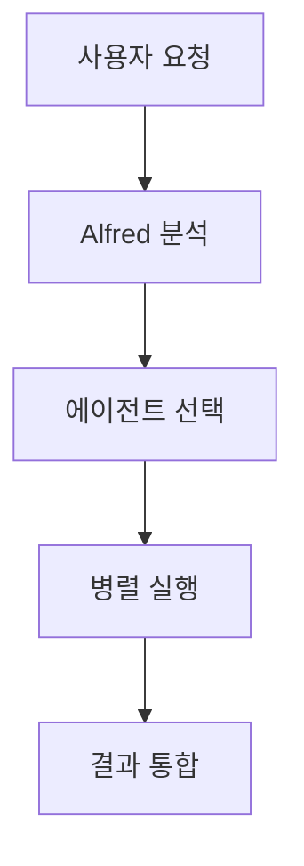

# vibe-coding-mcp 기술 문서

## 기술 스택 개요

vibe-coding-mcp는 Claude Code와 MoAI-ADK 프레임워크를 기반으로 구축된 다중 에이전트 코딩 자동화 시스템입니다. YAML 기반 설정, Python 훅, 다중 LLM 통합을 통해 고품질 소프트웨어 개발을 자동화합니다.

---

## 핵심 기술

### 1. Claude Code (오케스트레이션 엔진)

**버전**: 최신 (2026-01 기준)

**역할**: 시스템의 핵심 오케스트레이터로서 모든 에이전트와 스킬을 조정

**주요 기능**
- Task API를 통한 하위 에이전트 위임
- 200K 토큰 컨텍스트 윈도우
- AskUserQuestion을 통한 사용자 상호작용
- 도구 호출 병렬화
- 세션 간 컨텍스트 유지

**설정 파일**
- `.claude/agents/`: 에이전트 정의
- `.claude/commands/`: 슬래시 명령어
- `.claude/skills/`: 재사용 가능 스킬
- `.claude/hooks/`: 이벤트 기반 자동화

### 2. MoAI-ADK 프레임워크

**버전**: 10.4.0 (DDD + Progressive Disclosure + Auto-Parallel)

**핵심 구성 요소**

**TRUST 5 프레임워크**
- 품질 게이트 시스템
- 5대 핵심 기둥: Tested, Readable, Unified, Secured, Trackable
- 자동화된 검증 파이프라인

**SPEC-First DDD**
- EARS 형식 요구사항 명세
- 3단계 워크플로우: SPEC → DDD → Docs
- ANALYZE-PRESERVE-IMPROVE 사이클
- 동작 보존 리팩토링

**점진적 공개 시스템**
- 3단계 스킬 로딩
- 67% 토큰 절감
- JIT 컨텍스트 로딩

**위임 패턴**
- 전문화된 에이전트에게 작업 위임
- 순차적 및 병렬 실행
- 컨텍스트 최적화

---

## 프로그래밍 언어 및 런타임

### 1. YAML (주요 설정 언어)

**용도**: 모든 설정 파일, 에이전트 정의, 스킬 메타데이터

**주요 라이브러리**
- PyYAML: YAML 파싱 (Python 기반)
- yamllint: YAML 문법 검증

**사용 예시**
```yaml
# agent 정의
---
name: manager-spec
description: Create EARS format specifications
tools: Task, AskUserQuestion, Read, Write
model: sonnet

# config 설정
constitution:
  development_mode: ddd
  enforce_quality: true
  test_coverage_target: 85
```

### 2. Python (훅 및 자동화)

**버전**: 3.9+

**용도**: Git 훅, CI/CD 스크립트, 데이터 처리

**주요 라이브러리**
- `pyyaml`: YAML 처리
- `requests`: HTTP 요청
- `gitpython`: Git 작업 자동화
- `ast`: Python AST 분석
- `unittest`/`pytest`: 테스트

### 3. Bash/Shell (시스템 스크립트)

**용도**: 파일 시스템 작업, 프로세스 관리, 배포

**주요 도구**
- `bash`: 셸 스크립트
- `npm`/`npx`: Node.js 패키지 실행
- `git`: 버전 관리

---

## 프레임워크 및 라이브러리

### 1. MCP(Model Context Protocol)

**목적**: Claude Code와 외부 서비스 간 통신 표준

**구성 요소**

**Context7 MCP**
- 공식 라이브러리 문서 검색
- 최신 베스트 프랙티스 실시간 확인
- 패키지: `@upstash/context7-mcp@latest`

**Sequential Thinking MCP**
- 복잡한 문제 단계별 분해
- 추론 과정 추적 및 수정
- 패키지: `@modelcontextprotocol/server-sequential-thinking`

**설정** (`.mcp.json`)
```json
{
  "mcpServers": {
    "context7": {
      "command": "cmd",
      "args": ["/c", "npx", "-y", "@upstash/context7-mcp@latest"]
    },
    "sequential-thinking": {
      "command": "cmd",
      "args": ["/c", "npx", "-y", "@modelcontextprotocol/server-sequential-thinking"]
    }
  },
  "staggeredStartup": {
    "enabled": true,
    "delayMs": 500
  }
}
```

### 2. Nextra (문서 사이트 프레임워크)

**버전**: 3.x / 4.x

**목적**: Next.js 기반 정적 문서 사이트 생성

**주요 기능**
- MDX 지원 (Markdown + JSX)
- 파일 시스템 기반 라우팅
- 자동 검색 (FlexSearch)
- 국제화 (i18n) 지원
- 테마 커스터마이징

**설정** (`theme.config.tsx`)
```typescript
export default {
  logo: <span>MoAI-ADK</span>,
  project: {
    link: 'https://github.com/holee9/vibe-coding-mcp'
  },
  docsRepositoryBase: 'https://github.com/holee9/vibe-coding-mcp/tree/main',
  sidebar: {
    defaultMenuCollapseLevel: 1
  }
}
```

### 3. Mermaid (다이어그램)

**버전**: 11.12.2

**목적**: 텍스트 기반 다이어그램 생성

**지원 다이어그램 (21개)**
- Flowchart, Sequence, Class, ER, State
- Timeline, Gantt, Gitgraph
- C4, Architecture, Requirement
- Pie Chart, XY Chart, Sankey, Radar
- Mindmap, User Journey, Kanban, Packet

**사용 예시**


---

## LLM 통합

### 1. Claude (주요 LLM)

**제공자**: Anthropic

**모델**
- **Claude Sonnet 4.5** (claude-sonnet-4-5-20250929): 주요 작업
- **Claude Opus 4.5** (claude-opus-4-5-20251101): 복잡한 작업
- **Claude Haiku**: 빠른 작업 (가능 시)

**용도**
- 에이전트 오케스트레이션
- 코드 생성 및 리팩토링
- 아키텍처 설계
- 문서 생성

**특징**
- 200K 토큰 컨텍스트
- 높은 코드 품질
- 강력한 추론 능력

### 2. GLM (비용 효율적 LLM)

**제공자**: Zhipu AI

**모델**
- **GLM-4.7**: Sonnet급 작업
- **GLM-4.7-flashx**: Haiku급 빠른 작업

**API 엔드포인트**
```
https://open.bigmodel.cn/api/anthropic
```

**용도**
- 대규모 병렬 작업
- 비용 민감한 작업
- 하이브리드 모드

**설정** (`.moai/llm-configs/glm.json`)
```json
{
  "base_url": "https://open.bigmodel.cn/api/anthropic",
  "models": {
    "haiku": "glm-4.7-flashx",
    "sonnet": "glm-4.7",
    "opus": "glm-4.7"
  }
}
```

### 3. 라우팅 전략

**모드 선택** (`llm.mode`)

**claude-only** (기본값)
- 모든 단계에서 Claude 사용
- 최고 품질 보장
- 높은 비용

**mashup** (계획됨)
- SPEC 단계: Claude (품질)
- 실행 단계: GLM (비용)
- 문서 단계: Claude (정확성)

**glm-only** (계획됨)
- 모든 단계에서 GLM 사용
- 최저 비용
- 중간 품질

---

## 개발 도구

### 1. Git

**용도**: 버전 관리, 협업, 배포

**전략** (`.moai/config/sections/git-strategy.yaml`)
- feature 브랜치 워크플로우
- 구조화된 커밋 메시지
- Pull Request 템플릿

**커밋 메시지 형식**
```
type(scope): subject

body (optional)

footer (optional)
```

**유형**
- feat: 새로운 기능
- fix: 버그 수정
- docs: 문서
- refactor: 리팩토링
- test: 테스트
- chore: 기타

### 2. AST-Grep

**목적**: 구조적 코드 패턴 매칭

**장점**
- 코드 구문 이해
- 오탐 방지
- 빠른 검색

**사용 예시**
```bash
# Python 클래스 상속 패턴
sg -p 'class $X extends Service' --lang python

# TypeScript React 컴포넌트
sg -p 'function $C($$props) { return $$body }' --lang tsx
```

### 3. WebFetch/WebSearch

**목적**: 웹 문서 검색 및 검증

**용도**
- 최신 문서 검색
- 베스트 프랙티스 확인
- URL 검증
- 출처 확인

---

## 품질 도구

### 1. TRUST 5 품질 프레임워크

**Tested 기둥**
- pytest: Python 테스트
- unittest: 표준 라이브러리
- coverage.py: 커버리지 측정

**Readable 기둥**
- Ruff: Python 린터
- ESLint: JavaScript/TypeScript 린터
- Flake8: 스타일 검사

**Unified 기둥**
- Black: Python 포매터
- isort: 임포트 정렬
- Prettier: JavaScript 포매터

**Secured 기둥**
- Bandit: Python 보안 스캔
- Safety: 의존성 취약점
- OWASP ZAP: 웹 보안

**Trackable 기둥**
- Git: 버전 관리
- Conventional Commits: 커밋 형식
- Changelog: 변경 로그

### 2. 테스트 도구

**pytest**
- 특성화 테스트
- 명세 기반 테스트
- 커버리지 리포트

**Mutation Testing**
- mutmut: Python 변이 테스트
- 회귀 방지

### 3. CI/CD

**GitHub Actions** (계획됨)
- 자동화된 품질 게이트
- 문서 자동 배포
- 린터 및 테스트 실행

---

## 개발 환경

### 1. 필수 요구사항

**소프트웨어**
- Claude Code: 최신 버전
- Node.js: 18+ (npx용)
- Python: 3.9+ (훅용)
- Git: 2.30+

**API 키**
- Anthropic API Key (Claude)
- GLM_API_KEY (선택)
- GitHub Token (계획됨)

### 2. 설치 절차

**1단계: 저장소 클론**
```bash
git clone https://github.com/holee9/vibe-coding-mcp.git
cd vibe-coding-mcp
```

**2단계: Claude Code 설정**
```bash
# Claude Code가 프로젝트를 인식하도록 설정
# 자동으로 .claude/ 및 .moai/ 로드됨
```

**3단계: MCP 서버 설정**
```bash
# .mcp.json이 이미 구성되어 있음
# npx가 MCP 서버를 자동 시작
```

**4단계: 환경 변수 설정**
```bash
# ~/.zshrc 또는 ~/.bashrc
export GLM_API_KEY="your-glm-api-key"  # 선택사항
export ANTHROPIC_API_KEY="your-anthropic-key"
```

**5단계: 프로젝트 초기화**
```bash
/moai:0-project
```

### 3. 설정 파일

**`.moai/config/sections/llm.yaml`**
```yaml
llm:
  mode: claude-only  # claude-only / mashup / glm-only
  glm_env_var: GLM_API_KEY
```

**`.moai/config/sections/language.yaml`**
```yaml
language:
  conversation_language: ko
  agent_prompt_language: en
  git_commit_messages: ko
  code_comments: en
  documentation: ko
```

**`.moai/config/sections/quality.yaml`**
```yaml
constitution:
  development_mode: ddd
  enforce_quality: true
  test_coverage_target: 85
```

---

## 빌드 및 배포

### 1. 문서 빌드

**Nextra 문서 사이트**
```bash
# 의존성 설치
npm install

# 로컬 개발 서버
npm run dev

# 프로덕션 빌드
npm run build

# 정적 내보내기
npm run export
```

### 2. 배포 대상

**Vercel** (계획됨)
- 자동 배포
- 프리뷰 URL
- 도메인 커스터마이징

**GitHub Pages**
- 정적 호스팅
- 무료 사용

### 3. CI/CD 파이프라인 (계획됨)

```yaml
name: MoAI CI/CD

on:
  push:
    branches: [main]
  pull_request:
    branches: [main]

jobs:
  quality-gate:
    runs-on: ubuntu-latest
    steps:
      - Checkout 코드
      - TRUST 5 검증 실행
      - 테스트 커버리지 확인
      - 린터 검사

  build-docs:
    needs: quality-gate
    steps:
      - Nextra 문서 빌드
      - Vercel에 배포
```

---

## 성능 최적화

### 1. 토큰 최적화

**점진적 공개**
- 레벨 1: 100 토큰/스킬 (메타데이터)
- 레벨 2: 5K 토큰/스킬 (본문)
- 레벨 3: 무제한 (참조)

**토큰 절감**
- 초기 로드: 67% 감소
- 선택적 로딩
- 컨텍스트 재설정 (`/clear`)

### 2. 병렬 처리

**작업 분해**
- 독립 작업: 항상 병렬
- 최대 10개 에이전트 동시 실행
- Promise.all 패턴

### 3. 캐싱

**세션 캐시**
- 자주 사용하는 문서
- 프로젝트 구조
- 검색 결과

---

## 모니터링 및 로깅

### 1. 리포트 생성

**품질 리포트** (`.moai/reports/`)
- TRUST 5 점수
- 테스트 커버리지
- 린터 결과
- 보안 스캔

### 2. Git 추적

**커밋 메시지**
- 구조화된 형식
- 자동 생성
- 변경 추적

### 3. 성능 메트릭 (계획됨)

- 토큰 사용량
- 에이전트 실행 시간
- 병렬화 효율성

---

## 보안

### 1. API 키 관리

**환경 변수**
```bash
export ANTHROPIC_API_KEY="sk-ant-..."
export GLM_API_KEY="your-key"
```

**절대 .gitignore에 추가**
- `.env`
- `*.key`
- `secrets/`

### 2. 샌드박싱

**파일시스템**
- 쓰기 작업 제한
- 경로 화이트리스트

**네트워크**
- 도메인 화이트리스트
- 프록시 기반 제어

### 3. 감사

**Git 로그**
- 모든 변경 추적
- 커밋 메시지 분석

**접근 로그** (계획됨)
- 에이전트 호출 기록
- 도구 사용 로그

---

## 의존성 관리

### 1. Python 의존성

**필수 패키지**
```
pyyaml>=6.0
requests>=2.28
gitpython>=3.1
pytest>=7.0
coverage>=7.0
```

### 2. Node.js 의존성

**필수 패키지**
```json
{
  "dependencies": {
    "next": "^14.0.0",
    "nextra": "^3.0.0",
    "mermaid": "^11.0.0"
  },
  "devDependencies": {
    "typescript": "^5.0.0"
  }
}
```

### 3. MCP 패키지

```bash
# Context7
npx -y @upstash/context7-mcp@latest

# Sequential Thinking
npx -y @modelcontextprotocol/server-sequential-thinking
```

---

## 문제 해결

### 1. 일반적인 문제

**MCP 서버 연결 실패**
```bash
# npx가 설치되어 있는지 확인
which npx

# 수동 테스트
npx -y @upstash/context7-mcp@latest
```

**토큰 한도 초과**
```bash
# 컨텍스트 클리어
/clear

# SPEC 후 DDD 실행
/moai:1-plan "명세"
/clear
/moai:2-run SPEC-001
```

### 2. 디버깅

**로그 확인**
```bash
# Claude Code 로그
# 설정 → 개발자 → 로그 보기
```

**상태 확인**
```bash
/moai:alfred  # 시스템 상태 확인
```

---

## 참고 자료

### 공식 문서
- Claude Code: https://docs.anthropic.com/claude-code
- MCP: https://modelcontextprotocol.io/
- Nextra: https://nextra.site/
- Mermaid: https://mermaid.js.org/

### MoAI-ADK 문서
- GitHub: https://github.com/holee9/vibe-coding-mcp
- CLAUDE.md: 프로젝트 루트
- .moai/docs/: 상세 문서

---

*마지막 업데이트: 2026-01-22*
*문서 버전: 1.0.0*
